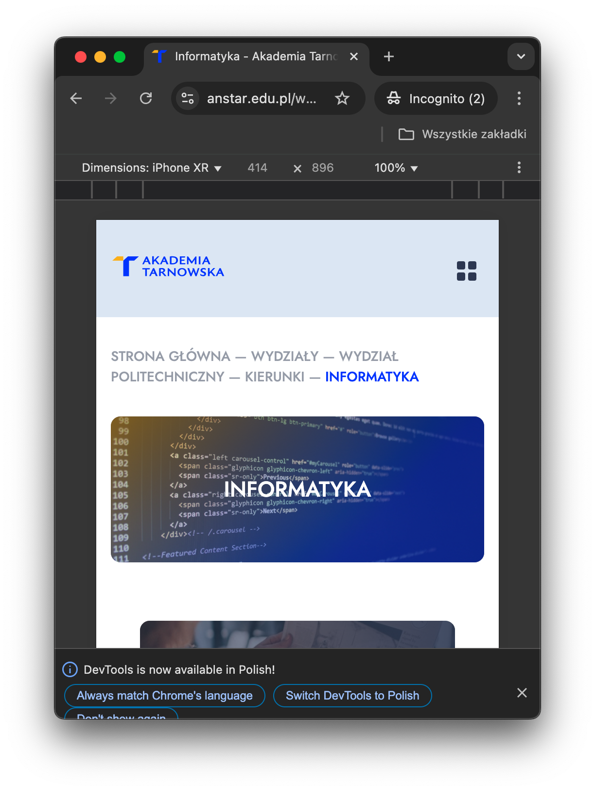

# Projektowanie interfejsów użytkownika

**P#01:** Wymagania.

**Wprowadzenie**

Poniższy dokument przedstawia wymagania dotyczące realizacji projektu z
przedmiotu **Projektowanie Interfejsów Użytkownika**. Projekt polega na
stworzeniu responsywnego interfejsu, składającego się z minimum pięciu
podstron, opartych o technologie HTML, CSS i JavaScript.

**Cel**

Głównym celem projektu jest praktyczne zastosowanie wiedzy nabytej
podczas zajęć poprzez samodzielne skonstruowanie nowoczesnego,
estetycznego i spójnego interfejsu. Projekt sprawdza umiejętności
dotyczące tworzenia responsywnych układów oraz wykorzystania
zewnętrznego API.

**Etapy realizacji**

Projekt jest podzielony na trzy etapy.

| Etap/Termin | Opis |
|:---|:---|
| Mockupy. Do 15 kwietnia. | Opracowanie makiet w programie dedykowanym (np. [Figma](https://www.figma.com), [Balsamiq](https://balsamiq.com)) dla wersji desktop, tablet i mobile. |
| Implementacja. Do 15 maja. | Implementacja interfejsu użytkownika, wykorzystanie API, przygotowanie responsywności. |
| Dokumentacja i testy. Do 15 czerwca. | Przygotowanie dokumentacji w [Markdown](https://www.markdownguide.org), testy aplikacji w przeglądarkach (Chrome, Edge, Safari, Firefox, Opera) na trzech rozdzielczościach. |

**Uwaga:** Niedotrzymanie terminów skutkuje obniżeniem oceny końcowej o
1 stopień.

**Wymagania dla poszczególnych widoków**

Aplikacja powinna składać się z minimum pięciu podstron. Każda podstrona
powinna zawierać menu, treść i stopkę.

| Widok/Podstrona | Wymagania funkcjonalne i wizualne |
|:---|:---|
| Strona główna | Powinna zawierać logo, menu nawigacyjne, stopkę oraz krótki opis. |
| Lista danych | Wyświetlanie listy elementów. Możliwość paginacji / sortowania / filtrowania wyników. Różne układy listy w zależności od ekranu (np. tabela na desktopie, karty na mobile). Dane można pobrać z publicznego API (np. [JSONPlaceholder](https://jsonplaceholder.typicode.com/)). |
| Szczegóły | Widok pojedynczego elementu (np. użytkownik, post, produkt). Dynamiczne pobieranie szczegółowych danych po kliknięciu na element listy. Przyciski **Wróć** i **Edytuj** (jeśli aplikacja to umożliwi). |
| Podstrona z 3 kolumnami | Desktop: 3 kolumny obok siebie. Tablet: 2 kolumny + 1 poniżej. Mobile: układ jednokolumnowy. Zawartość powinna mieć konsekwentny układ i spójne nagłówki. |
| Dodatkowa podstrona | Może zawierać np. formularz kontaktowy, galerię zdjęć. |

**Responsywność**

Projekt musi być w pełni responsywny.

- Desktop: \[szerokość\] ≥ 1024px
- Tablet : \[szerokość\] ≥ 768px i \[szerokość\] ≤ 1023px
- Mobile : \[szerokośc\] ≤ 767px

Aplikacja będzie testowana w przeglądarce **Google Chrome** na trzech
wiodących rozdzielczościach.

**Dodatkowe wymagania**

Użyj **GitHub** / **Bitbucket** do wersjonowania kodu. Proponuje użyć
**GitHub Pages** do hostowania projektu. Mile widziane stosowanie
metodologii **BEM** w CSS.

**Dokumentacja**

Dokumentacja projektu powinna zawierać:

- Wstęp.
- Opis struktury serwisu.
- Opis technologii zastosowanych przy tworzeniu serwisu.
- Testy.
- Podsumowanie.

**Podsumowanie**

Zrealizowanie wszystkich założeń projektowych jest niezbędne do
zaliczenia przedmiotu. Stosowanie dobrych praktyk projektowych (np.
responsywność, dostępność, przejrzysty kod) przyniesie korzyści w
postaci użytecznej i estetycznej aplikacji internetowej.
