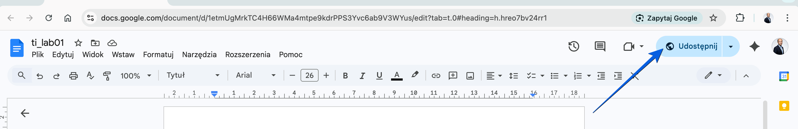
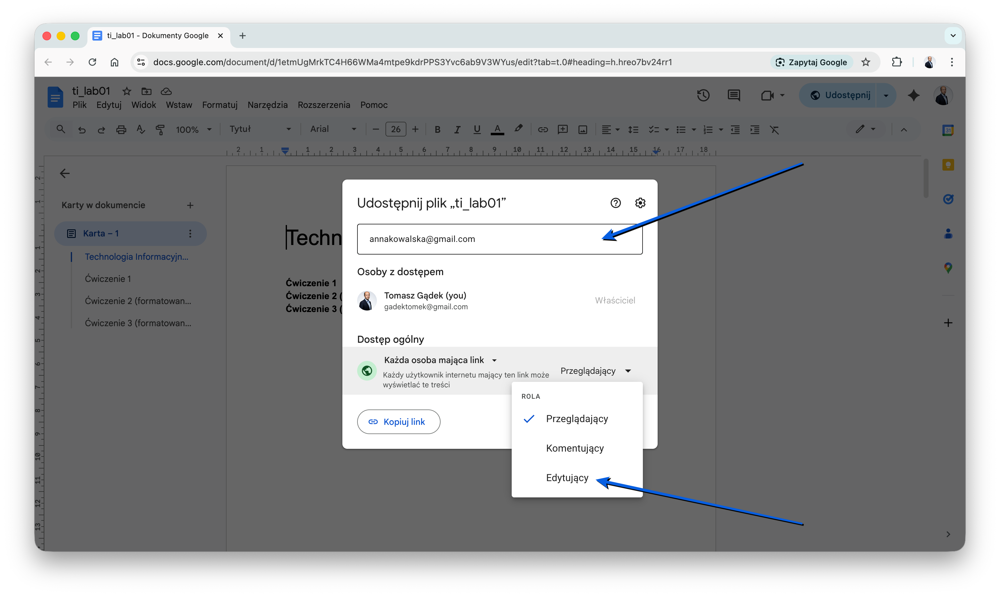

# Technologia informacyjna

**Laboratorium 1:** Wprowadzenie do Google Docs.

**Wprowadzenie**

**Google Docs** to darmowy edytor tekstu online, który pozwala na tworzenie, edytowanie i współdzielenie dokumentów w czasie rzeczywistym. Wszystkie pliki są przechowywane w chmurze na Dysku Google, co zapewnia do nich dostęp z dowolnego urządzenia z połączeniem internetowym.

**Cel laboratorium**

Głównym celem zajęć jest zapoznanie się z edytorem **Google Docs** oraz poznanie mechanizmów jednoczesnej pracy wielu osób nad tym samym tekstem. Dowiesz się, jak udostępniać pliki oraz jak je poprawnie formatować, korzystając z dostępnych narzędzi i przygotowanych wskazówek.

**Konto Google**

Aby korzystać z **Google Docs**, [załóż konto Google](https://www.google.com). Jest to konieczne, ponieważ wszystkie pliki są przechowywane w chmurze na Dysku Google, co zapewnia do nich dostęp z dowolnego urządzenia z połączeniem internetowym.

**Praca zespołowa w Google Docs**

Jedną z największych zalet **Google Docs** jest możliwość udostępniania dokumentów innym osobom i wspólnej edycji w czasie rzeczywistym. Oznacza to, że kilku użytkowników może pracować nad tym samym dokumentem jednocześnie, widząc wprowadzane zmiany na bieżąco. Dzięki temu **Google Docs** doskonale sprawdza się w pracy zespołowej, zwłaszcza podczas tworzenia notatek, raportów czy prac grupowych.

Proszę wpisać swoje dane na [listę obecności](https://docs.google.com/document/d/13jvo7CuwsYmz5Kt2i2YTg0ppSoXeA3_71YBVbelBJR4/edit?usp=sharing).

**Ćwiczenie 1: Praca w grupach**

Proszę dobrać się w pary. Następnie jedna osoba z pary tworzy nowy dokument **Google Docs** (spójrz na film).

<video controls preload="auto">
  <source src="./static/ti-lab01-create-doc.mp4" type="video/mp4">
  Twoja przeglądarka nie obsługuje wideo.
</video>

Następnie udostępnia go koledze / koleżance.

W kolejnym kroku proszę podać uprawnienia do edycji pliku podając adres e-mail kolegi / koleżanki z zespołu. Proszę wprowadzić do dokumentu (równolegle) swoje imiona i nazwiska.

Po wykonaniu ćwiczenia 1 kolejne zadania realizujemy już **samodzielnie**.

**Ćwiczenie 2: Formatowanie tekstu**

W udostępnionym [pliku](https://docs.google.com/document/d/1etmUgMrkTC4H66WMa4mtpe9kdrPPS3Yvc6ab9V3WYus/edit?usp=sharing) (strona 3) będą znajdowały się specjalne znaczniki, które pomogą Ci poprawnie sformatować dokument. Oto wskazówki, jak je interpretować:

- W nawiasach klamrowych **{}** znajdują się komentarze — są to wskazówki dotyczące formatowania. Po wykonaniu zadania należy je usunąć.
- **{nagłówek 1 poziomu}** oznacza, że dany fragment tekstu powinien być nagłówkiem pierwszego poziomu.
- **{dodaj odstęp}** – w tym miejscu powinien znaleźć się dodatkowy odstęp między akapitami. Nie należy stosować **ENTER** do oddzielania akapitów – zamiast tego ustaw odpowiednie odstępy między nimi.
- Akapity powinny być **wyjustowane** – oznacza to, że tekst powinien być równomiernie rozłożony na całej szerokości strony.
- Odstępy między wierszami powinny wynosić **1,5** – ustaw taką wartość w opcjach formatowania tekstu.
- **\*tekst\*** – oznacza, że dany tekst powinien być pogrubiony.
- **/tekst/** – oznacza, że dany tekst powinien być pochylony (kursywą).
- **{lista numerowana}** – ten fragment powinien być zamieniony na listę numerowaną.
- **{lista wypunktowana}** – ten fragment powinien być zamieniony na listę wypunktowaną.

Twoim zadaniem będzie poprawne sformatowanie tekstu zgodnie z powyższymi wskazówkami, a następnie usunięcie wszystkich **{komentarzy}**.

Otwórz [dokument](https://docs.google.com/document/d/1etmUgMrkTC4H66WMa4mtpe9kdrPPS3Yvc6ab9V3WYus/edit?usp=sharing) (strona 3) i skopiuj jego zawartość do nowego pliku. Następnie postępuj zgodnie z poniższym tutorialem.

<video controls preload="auto">
  <source src="./static/ti-lab01-google-docs-tutorial.mp4" type="video/mp4">
  Twoja przeglądarka nie obsługuje wideo.
</video>

**Ćwiczenie 3: Samodzielna rozbudowa**

Tym razem postaraj się samodzielnie sformatować [dokument](https://docs.google.com/document/d/1etmUgMrkTC4H66WMa4mtpe9kdrPPS3Yvc6ab9V3WYus/edit?usp=sharing) (strona 4 i 5). Zwróć uwagę na nowe elementy (wskazówki będą pomocne). W razie problemów poproś o pomoc prowadzącego zajęcia.

Nowe elementy w zadaniu:

- Wstawianie obrazu: Menu → Wstaw → Obraz.
- Tworzenie tabeli: Menu → Wstaw → Tabela (wybierz liczbę kolumn i wierszy).
- Zmiana koloru tła komórki: Zaznacz komórki w tabeli; Menu → Formatuj → Tabela → Właściwości tabeli (Wybierz: **Kolor** / **Kolor tła komórki**).
- Wstawianie spisu treści: Przejdź na początek dokumentu; Menu → Wstaw → Spis treści.
- Dodanie wcięcia: Przejdź na początek akapitu; Menu → Formatuj → Wyrównanie i wcięcia (Zwiększ lub zmniejsz wcięcie).

**Zadanie dodatkowe: Plan zajęć**

Przygotuj harmonogram swoich zajęć w **Google Docs**, wzoruj się na [oryginale](https://anstar.edu.pl/wp-content/uploads/2025/02/00-rozklad-zajec-semestr-letni-24-25-9.pdf) udostępnionym przez **AT Tarnów**.

Wskazówki:

- Ustaw orientację strony na poziomą.
- Wstaw tabelę i uzupełnij ją.
- Odpowiednio sformatuj dokument, dbając o czytelność i estetykę.
- Wyróżnij wybrane komórki, jeśli uznasz to za stosowne.

**Podsumowanie**

Praca w chmurze z dokumentami tekstowymi to dzisiaj standard, który znacząco ułatwia przygotowywanie notatek czy wspólnych projektów. Umiejętność sprawnej edycji plików online oraz dbałość o ich estetykę przekładają się na profesjonalny wygląd raportów i prac grupowych. Dzięki tym kompetencjom Twoje dokumenty będą czytelne i odpowiednio uporządkowane.
