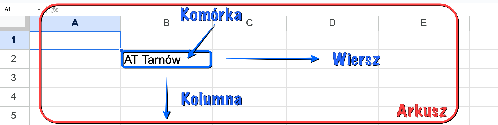
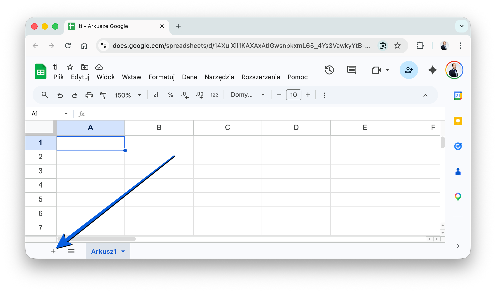

# Technologia informacyjna

**Laboratorium 3:** Wprowadzenie do Google Sheets.

## Wprowadzenie

**Google Sheets** (Arkusze Google) to internetowy arkusz kalkulacyjny, umożliwiający tworzenie i analizę danych w tabelach. Działa w chmurze, umożliwiając współpracę wielu użytkowników w czasie rzeczywistym. Jest to darmowe narzędzie będące częścią pakietu **Google Workspace**, które łatwo integruje się z innymi aplikacjami.

## Cel laboratorium

Celem zajęć jest zapoznanie się z aplikacją **Google Sheets** oraz opanowanie podstawowej analizy danych. Podczas pracy poznasz pojęcia arkusza, komórki i formuł, będziesz w stanie formatować dane, używać podstawowych funkcji do prostych kalkulacji oraz tworzyć wykresy, by podnieść czytelność prezentowanych parametrów.

## Podstawowe pojęcia

**Arkusz**: Pojedyncza strona w pliku Google Sheets, składająca się z siatki wierszy i kolumn.

**Wiersz**: Poziomy układ komórek, oznaczony liczbami (1, 2, 3...).

**Kolumna**: Pionowy układ komórek, oznaczony literami (A, B, C...).

**Komórka**: Pojedynczy prostokąt, w którym znajdują się dane, oznaczony adresem (np. **A1**, **B2**).



## Tutorial: Jak dodać nowy arkusz?

W lewym dolnym rogu ekranu znajduje się przycisk **"+"** (Dodaj arkusz).



## Tutorial: Formatowanie warunkowe

To narzędzie, które pozwala automatycznie formatować komórki (np. zmieniać kolor tła lub tekstu) na podstawie określonych warunków. Przydaje się na przykład do oznaczania na zielono komórek z wynikami powyżej 2.0.

<video controls preload="auto">
  <source src="./static/ti-lab03-format-condition.mp4" type="video/mp4">
  Twoja przeglądarka nie obsługuje wideo.
</video>

## Tutorial: Format danych

Format danych pozwala określić, jak dane są wyświetlane w komórkach (np. jako liczby z dwoma miejscami po przecinku, daty w odpowiednim i oczekiwanym formacie lub waluty).

<video controls preload="auto">
  <source src="./static/ti-lab03-format-data.mp4" type="video/mp4">
  Twoja przeglądarka nie obsługuje wideo.
</video>

## Tutorial: Formuły

Formuły to wyrażenia wykonujące obliczenia na danych w arkuszu. Formuła zawsze zaczyna się od znaku równości (**=**). Można używać wbudowanych funkcji (np. **SUM()**) oraz operatorów matematycznych (np. **+**, **-**, **\***, **/**).

Wstawienie:

```text
=SUM(C3:C5)
```

Sumuje wartości w komórkach od C3 do C5.

<video controls preload="auto">
  <source src="./static/ti-lab03-avg.mp4" type="video/mp4">
  Twoja przeglądarka nie obsługuje wideo.
</video>

## Tutorial: Funkcja COUNTIF()

Funkcja **COUNTIF()** zlicza komórki w danym zakresie, które spełniają określone z góry kryteria.

Składnia:

```text
COUNTIF(zakres; kryteria)
```

Przykład:

```text
COUNTIF(C2:C5; ">2")
```

Zlicza, ile razy w zadanym zakresie od C2 do C5 wynik jest większy od 2.

<video controls preload="auto">
  <source src="./static/ti-lab03-countif.mp4" type="video/mp4">
  Twoja przeglądarka nie obsługuje wideo.
</video>

## Tutorial: Tworzenie wykresów

Zaznacz dane, które chcesz zaprezentować na wykresie. Kliknij **Wstaw** w górnym obszarze menu, a następnie wybierz **Wykres**. Później, w **Edytorze wykresów** po prawej stronie, po prostu wybierz typ odpowiadającego ci wykresu i dodatkowo dostosuj jego ogólny wygląd.

<video controls preload="auto">
  <source src="./static/ti-lab03-create-figure.mp4" type="video/mp4">
  Twoja przeglądarka nie obsługuje wideo.
</video>

## Tutorial: Funkcja IF()

Funkcja **IF()** zwraca jedną wartość, jeśli dany zadeklarowany warunek logiczny jest spełniony, oraz inną docelową wartość, jeśli ten nie jest spełniony.

Składnia:

```text
IF(warunek; wartość_jeśli_prawda; wartość_jeśli_fałsz)
```

Przykład z życia:

```text
=IF(C3>2; "Zal"; "Brak zal")
```

Jeżeli wartość wskazana w komórce C3 jest wyższa niż 2, nastąpi zwrócenie "Zal", w przeciwnym razie wpisze po prostu "Brak zal".

<video controls preload="auto">
  <source src="./static/ti-lab03-if.mp4" type="video/mp4">
  Twoja przeglądarka nie obsługuje wideo.
</video>

Zwróć uwagę, że wystarczy wprowadzić formułę do jednej komórki, a następnie przeciągnąć ją do pozostałych a formuła dostosuje się do każdej komórki.

## Zadanie 1: Rekordy biegowe (wprowadzanie i edycja danych)

**Dane:** Lista 10 zawodników, ich imiona, nazwiska i czasy uzyskane w biegu na 100 metrów.

```text
Imię;Nazwisko;Czas (sekundy)
Jan;Kowalski;10,5
Anna;Nowak;11,2
Piotr;Wiśniewski;10,8
Maria;Dąbrowska;11,5
Andrzej;Lewandowski;10,9
Katarzyna;Wójcik;11,1
Tomasz;Kamiński;10,7
Magdalena;Kowalczyk;11,4
Marek;Zieliński;11,0
Ewa;Szymańska;11,3
```

**Polecenie:** Utwórz nowy arkusz i wprowadź dane do nowego arkusza. Użyj klawiszy Enter (przenosi do następnego wiersza), Tab (przenosi do następnej kolumny) i F2 (edytuj komórkę) do nawigacji i edycji danych.

## Zadanie 2: Analiza wyników skoku w dal (formatowanie danych)

**Dane:** Wyniki 15 zawodników w skoku w dal (w metrach).

```text
Imię;Nazwisko;Wynik (metry)
Jan;Kowalski;6,85
Anna;Nowak;7,12
Piotr;Wiśniewski;6,98
Maria;Dąbrowska;7,25
Andrzej;Lewandowski;6,78
Katarzyna;Wójcik;7,05
Tomasz;Kamiński;7,30
Magdalena;Kowalczyk;6,92
Marek;Zieliński;7,18
Ewa;Szymańska;7,20
Krzysztof;Jankowski;6,88
Alicja;Mazur;7,00
Paweł;Krawczyk;7,35
Beata;Gajewska;6,95
Adam;Rutkowski;7,22
```

**Polecenie:** Utwórz nowy arkusz i wprowadź dane. Sformatuj komórki, aby wyświetlały wyniki z dokładnością do dwóch miejsc po przecinku. Zastosuj formatowanie warunkowe, aby wyróżnić wyniki powyżej 7 metrów.

## Zadanie 3: Obliczanie BMI (podstawowe funkcje)

**Dane:** Lista 20 osób, ich waga (w kilogramach) i wzrost (w metrach).

```text
Imię;Nazwisko;Waga (kg);Wzrost (m)
Jan;Kowalski;80;1,80
Anna;Nowak;65;1,65
Piotr;Wiśniewski;90;1,85
Maria;Dąbrowska;70;1,70
Andrzej;Lewandowski;85;1,90
Katarzyna;Wójcik;60;1,60
Tomasz;Kamiński;75;1,75
Magdalena;Kowalczyk;68;1,68
Marek;Zieliński;95;1,95
Ewa;Szymańska;72;1,72
Krzysztof;Jankowski;88;1,88
Alicja;Mazur;63;1,63
Paweł;Krawczyk;92;1,92
Beata;Gajewska;67;1,67
Adam;Rutkowski;82;1,82
Karolina;Sokołowska;58;1,58
Rafał;Pawlak;98;1,98
Agata;Lis;78;1,78
Michał;Woźniak;83;1,83
Sylwia;Kozłowska;69;1,69
```

**Polecenie:** Utwórz nowy arkusz i wprowadź dane. Użyj formuły do obliczenia BMI dla każdej osoby na podstawie wzoru: waga / wzrost². Zastosuj formatowanie do wyświetlania wyników z dokładnością do 2 miejsc po przecinku.

## Podsumowanie

Google Sheets to narzędzie, które pozwala na organizację danych, obliczenia i wizualizację wyników. Dzięki prostym funkcjom i automatycznym formułom łatwo przygotować raporty, zestawienia i analizy nawet bez specjalistycznej wiedzy technicznej.
