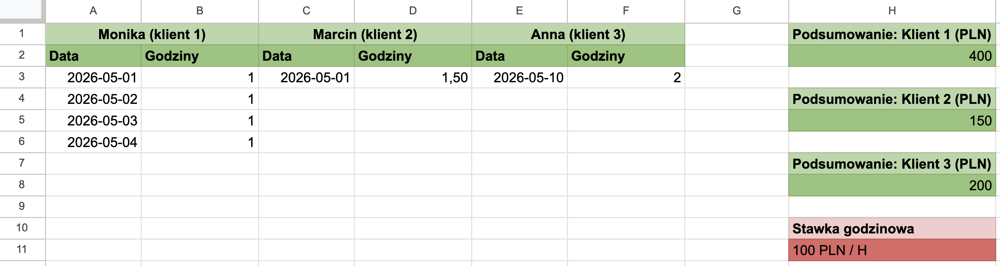
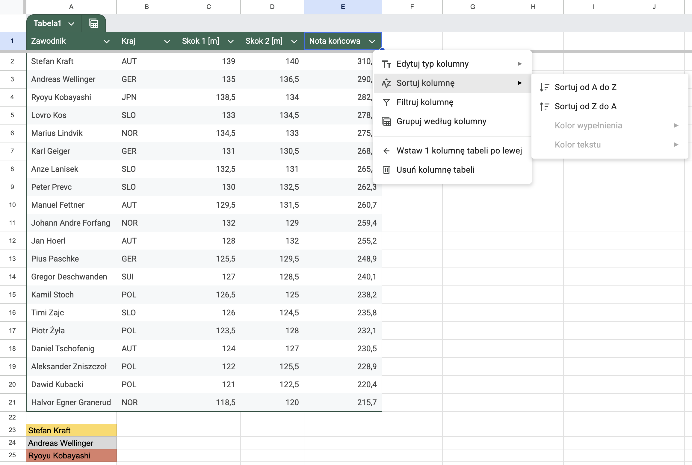

# Technologia informacyjna

**Laboratorium 4:** Google Sheets.

## Wprowadzenie

Praca nauczyciela WF, trenera czy organizatora zawodów to nie tylko bezpośredni kontakt z zawodnikami, ale też mnóstwo "papierkowej" roboty. **Google Sheets** to Twój osobisty, wirtualny asystent, który automatycznie przeliczy stawki za treningi personalne, błyskawicznie wskaże najszybszego sprintera w klasie i wyłoni zwycięzców turnieju piłkarskiego. Narzędzia informatyczne oszczędzają Twój czas, pozwalając Ci skupić się na tym, co najważniejsze — na sporcie.

## Cel laboratorium

Dowiesz się, jak zautomatyzować codzienną pracę trenera i organizatora zawodów. Nauczysz się blokować komórki w formułach (adresacja bezwzględna). Przećwiczysz sortowanie i filtrowanie list zawodników. Zbudujesz powiązane ze sobą arkusze wyników.

## Zadanie 1: Karta pracy trenera personalnego

Jako trener personalny, musisz sprawnie zarządzać rozliczeniami ze swoimi podopiecznymi. Obecnie prowadzisz 3 stałych klientów, z których każdy trenuje w innym trybie: jeden codziennie, drugi raz w tygodniu, a trzeci wpada na salę sporadycznie.

Przygotuj arkusz w taki sposób, aby każdy klient posiadał swoją własną sekcję składającą się z dwóch kolumn: **daty treningu** oraz **liczby przepracowanych godzin**. W efekcie Twój arkusz będzie posiadał 6 kolumn z danymi (np. kolumna A — data, kolumna B — godziny dla pierwszego klienta, kolumna C — data, kolumna D — godziny dla drugiego klienta itd.).

W pracy trenera lista danych ciągle rośnie. Zamiast co chwilę poprawiać formuły (np. zmieniać `SUMA(A2:A10)` na `SUMA(A2:A100)`), Google Sheets pozwala na stosowanie tzw. **zakresów otwartych**. Zapis `A2:A` (bez cyfry na końcu) oznacza: "weź wszystko od drugiego wiersza aż do samego dołu arkusza".

Przygotuj **trzy oddzielne podsumowania kosztów** (po jednym dla każdego klienta). Wykorzystaj mechanizm zakresów otwartych (np. `=SUMA(B3:B) * 100`), aby Twoje formuły automatycznie doliczały każdą nową sesję wpisaną do arkusza w przyszłości. Pozwoli Ci to na prowadzenie rozliczeń "w nieskończoność" bez żadnych poprawek w strukturze pliku.

Oto przykładowy rezultat. Pamiętaj, że wprowadzenie nowych danych powinno automatycznie aktualizować podsumowania.



## Zadanie 2: Tabela skoczków narciarskich

Podczas zawodów w skokach narciarskich gromadzisz dziesiątki pomiarów. Przeanalizowanie ich "na oko" i ręczne szukanie lidera bywa uciążliwe i sprzyja pomyłkom. Twoim zadaniem jest przepisanie poniższych danych do arkusza. Zrób to dokładnie w takiej kolejności, w jakiej są podane (dane są celowo nieposortowane).

```csv
Zawodnik;Kraj;Skok 1 [m];Skok 2 [m];Nota końcowa
Ryoyu Kobayashi;JPN;138,5;134,0;282,1
Stefan Kraft;AUT;139,0;140,0;310,5
Anze Lanisek;SLO;132,5;131,0;265,4
Andreas Wellinger;GER;135,0;136,5;290,8
Jan Hoerl;AUT;128,0;132,0;255,2
Pius Paschke;GER;125,5;129,5;248,9
Karl Geiger;GER;131,0;130,5;268,2
Marius Lindvik;NOR;134,5;133,0;275,6
Gregor Deschwanden;SUI;127,0;128,5;240,1
Peter Prevc;SLO;130,0;132,5;262,3
Timi Zajc;SLO;126,0;124,5;235,8
Lovro Kos;SLO;133,0;134,5;278,9
Johann Andre Forfang;NOR;132,0;129,0;259,4
Manuel Fettner;AUT;129,5;131,5;260,7
Daniel Tschofenig;AUT;124,0;127,0;230,5
Kamil Stoch;POL;126,5;125,0;238,2
Piotr Żyła;POL;123,5;128,0;232,1
Dawid Kubacki;POL;121,0;122,5;220,4
Halvor Egner Granerud;NOR;118,5;120,0;215,7
Aleksander Zniszczoł;POL;122,0;125,5;228,9
```

Po wprowadzeniu wszystkich 20 wierszy, zamień te dane w profesjonalną bazę! Zaznacz obszar z wartościami i z górnego menu wybierz opcję **Formatuj → Przekonwertuj na tabelę**.

Następnie wykorzystaj funkcję sortowania tabeli, aby uszeregować zawodników według **noty końcowej** (od największej do najmniejszej).

**Podpowiedź:** Aby to zrobić, kliknij małą ikonę strzałki (filtrowania) w nagłówku kolumny "Nota końcowa" i wybierz opcję **Sortuj Z-A**. Dzięki temu od razu zweryfikujesz wyniki i zobaczysz, kto stanął na podium. Na koniec, pod stworzoną tabelą, wypisz ręcznie imiona i nazwiska trzech najlepszych skoczków tych zawodów.

Oto przykładowy rezultat:



## Zadanie 3: Wyniki biegu na 60m

Na lekcji WF sprawdzasz czasy swoich uczniów w sprincie na 60 metrów. Chcesz szybko obliczyć i pokazać młodzieży, ile sekund stracili do najszybszego zawodnika. Aby zrobić to sprawnie, musisz zrozumieć **mechanizm blokowania komórek**, czyli różnicę między adresacją względną a bezwzględną.

Wyobraź sobie, że symbol dolara (`$`) to solidna kłódka. To, co stoi bezpośrednio po nim, zostaje "zamrożone" i nie zmienia się podczas kopiowania formuły:

- **A1** — **Pełna swoboda:** Przeciągasz w dół? Zmienia się wiersz (A2, A3...). Przeciągasz w bok? Zmienia się kolumna (B1, C1...).
- **$A1** — **Zablokowana kolumna:** Zawsze będziemy patrzeć na kolumnę A, ale wiersze będą się zmieniać przy przeciąganiu w dół.
- **A$1** — **Zablokowany wiersz:** Zawsze będziemy patrzeć na 1. wiersz, ale kolumny mogą się zmieniać przy przeciąganiu w bok.
- **$A$1** — **Pełna blokada (adresacja bezwzględna):** Komórka jest całkowicie zamrożona. Niezależnie gdzie przeciągniesz formułę, ona zawsze będzie brała wartość z tego samego miejsca.

**Eksperymenty przygotowawcze (wykonaj w nowym arkuszu):**

1. Wprowadź czasy zawodników w komórkach od A2 do A8.
2. W komórce B2 wpisz formułę obliczającą różnicę w czasie względem najlepszego wyniku.
3. Wykorzystaj odwołanie bezwzględne do komórki z najlepszym czasem.
4. Przeciągnij formułę w dół i sprawdź poprawność wyników.

## Podsumowanie

Google Sheets jest przydatnym narzędziem do automatyzacji obliczeń, analizy danych, budowania tabel i zarządzania wynikami. Umożliwia oszczędność czasu oraz sprawniejszą pracę z informacjami w praktyce szkolnej i zawodowej.
