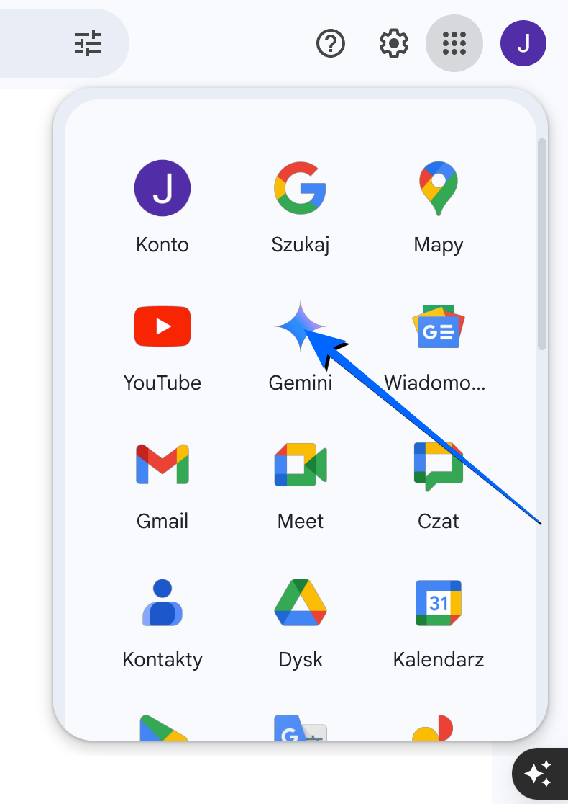
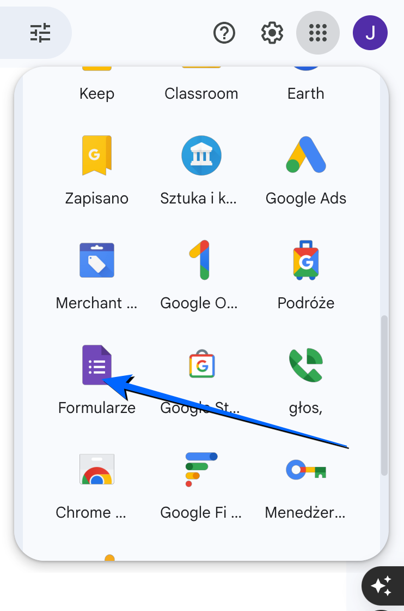
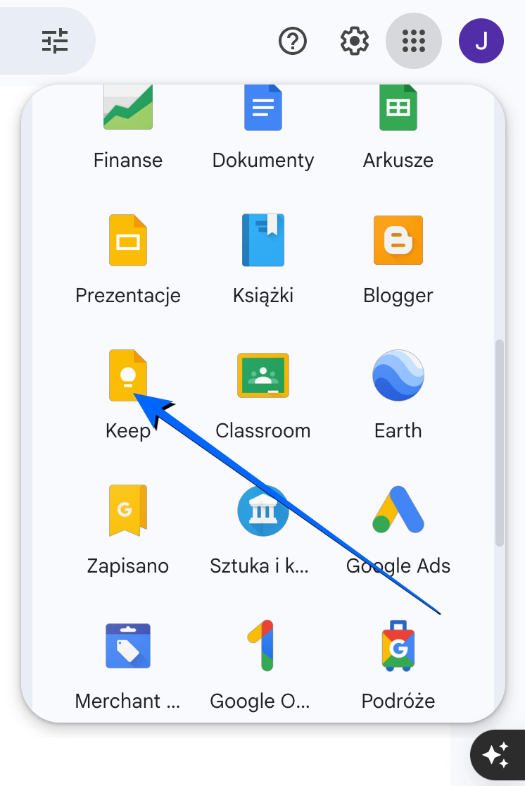

# Technologia informacyjna

**Laboratorium 2:** Google Workspace (Gemini, Keep i Forms).

**Wprowadzenie**

W dobie cyfrowej transformacji narzędzia chmurowe ułatwiają codzienne i zawodowe zadania. Integracja wszechstronnych rozwiązań pozwala na wygodniejszą edukację. Na szczególną uwagę zasługuje wsparcie sztucznej inteligencji (**Google Gemini**), intuicyjne budowanie formularzy czy ankiet (**Google Forms**) oraz efektywne zarządzanie informacjami przez cyfrowe notatki i zadania (**Google Keep**).

**Cel laboratorium**

Głównym celem zajęć jest praktyczne opanowanie i płynne posługiwanie się nowoczesnymi usługami z rodziny **Google Workspace**. W trakcie laboratorium wykorzystamy asystenta AI do szybkiego generowania i parafrazowania treści, utworzymy logiczny formularz do zbierania istotnych opinii, jak i zorganizujemy plan dnia za pomocą list do zrobienia (TO-DO). Wymienione umiejętności to kluczowe elementy nowoczesnej produktywności.

**Organizacja plików**

Zaloguj się na swoje konto **Google**, otwórz **Google Drive** (<https://drive.google.com/>) oraz uporządkuj swoje pliki. Postępuj zgodnie z poniższym filmikiem.

<video controls preload="auto">
  <source src="./static/ti-lab02-folders.mp4" type="video/mp4">
  Twoja przeglądarka nie obsługuje wideo.
</video>

**Generowanie treści w Google Gemini**

**Google Gemini** to bardzo zaawansowany [model językowy](https://pl.wikipedia.org/wiki/Duży_model_językowy). Wyobraź sobie go jako inteligentnego asystenta, który potrafi: rozumieć i generować tekst, przetwarzać informacje, uczyć się i dostosowywać.

Otwórz **Google Gemini** (<https://gemini.google.com/>) oraz wpisz zapytanie (*prompt*). Skuteczny prompt powinien jasno określać rolę (personę), dokładne zadanie do wykonania, jego kontekst operacyjny oraz format wyjściowy. Skopiuj poniższą treść, a następnie wklej ją do chat'u Gemini:

> *Jesteś doświadczonym trenerem personalnym i ekspertem ds. zdrowia. Napisz krótki, motywujący artykuł o wpływie aktywności fizycznej na zdrowie. Tekst jest skierowany do początkujących studentów, którzy prowadzą w dużej mierze siedzący tryb życia i chcą zacząć ćwiczyć. Pisaną treść podziel na następujące sekcje: «Wpływ aktywności fizycznej na zdrowie», «Korzyści z siłowni», «Bieganie jako forma aktywności» i «Zalety pływania». Użyj również wypunktowań by uwypuklić zalety każdej z aktywności.*

- **Persona** — jaką rolę powinna przyjąć sztuczna inteligencja?
- **Zadanie** — główne polecenie do wykonania.
- **Kontekst** — dodatkowe szczegóły pomagające sprecyzować odbiorcę.
- **Wyjście** — jak dokładnie ma wyglądać tekst końcowy.

Więcej wskazówek na temat tego, jak efektywnie konstruować zapytania, znajdziesz w [oficjalnym przewodniku po promptach Google Workspace](https://workspace.google.com/intl/pl/resources/ai/writing-effective-prompts/).

Skopiuj wygenerowany tekst i wklej go do nowego dokumentu **Google Docs**. Edytuj treść tak, aby miała dla Ciebie sens. Możesz zmienić przykłady, dodać swoje doświadczenia lub usunąć niepotrzebne fragmenty. Plik powinien posiadać odpowiednią nazwę: **Wpływ aktywności fizycznej na zdrowie**.

**Formatowanie dokumentu**

Sformatuj dokument według poniższych zasad:

- **Nagłówek 1**: "Wpływ aktywności fizycznej na zdrowie".
- **Nagłówek 2**: "Korzyści z siłowni".
- **Nagłówek 2**: "Bieganie jako forma aktywności".
- **Nagłówek 2**: "Zalety pływania".
- Dodaj pogrubienie dla najważniejszych fragmentów tekstu.
- Dodaj punktowaną listę przedstawiającą zalety każdej z aktywności.
- Dodaj obrazek związany z aktywnością fizyczną (wygeneruj obrazek w Gemini, skorzystaj z narzędzia **Utwórz obraz**).

Zapisz dokument w folderze **lab02**.

**Google Forms**

**Google Forms** to bezpłatne narzędzie online, które umożliwia tworzenie profesjonalnych ankiet, testów, formularzy rejestracyjnych oraz innych interaktywnych kwestionariuszy. Dzięki intuicyjnemu interfejsowi użytkownika, nawet osoby bez specjalistycznej wiedzy technicznej mogą z łatwością projektować i rozpowszechniać formularze, a następnie analizować zebrane odpowiedzi.

Otwórz **Google Forms** (<https://forms.google.com/>) i utwórz nowy formularz zatytułowany **Nawyki sportowe studentów - ankieta**.

Dodaj następujące pytania:

- Imię i nazwisko (Krótka odpowiedź: wymagane).
- Jak często uprawiasz sport? (Jednokrotny wybór: codziennie, kilka razy w tygodniu, raz w tygodniu, rzadko).
- Jaką formę aktywności wybierasz najczęściej? (Wielokrotny wybór: siłownia, bieganie, pływanie, sporty zespołowe, inne).
- Ile czasu poświęcasz na trening? (Jednokrotny wybór: mniej niż 30 minut, 30-60 minut, więcej niż 60 minut)
- Jak oceniasz swój poziom sprawności fizycznej? (Skala 1-5)

Udostępnij formularz koledze / koleżance w grupie. Następnie przeanalizuj wyniki.

**Google Keep**

**Google Keep** to cyfrowy notes, który pozwala szybko zapisywać myśli, tworzyć listy zadań, dodawać zdjęcia. Służy do organizacji codziennych spraw, przypominania o ważnych zadaniach i łatwego dostępu do notatek z dowolnego urządzenia.

Otwórz **Google Keep** oraz dodaj notatki.

Twoje zadanie będzie polegało na sporządzeniu odpowiednich notatek. Skopiuj poniższą treść do własnych notatek. Ustaw odpowiednie etykiety oraz tła dla notatek.

**Notatka 1**:

Tytuł: "Sportowe kino motywacji"

- "Siła spokoju" - (Dramat, sportowy) - historia gimnastyka, który uczy się żyć tu i teraz.
- "Najlepszy" - (Biograficzny, sportowy) - Oparty na faktach film o triathloniście Jerzym Górskim, który pokonuje własne słabości.
- "Rydwany ognia" - (Dramat, sportowy) - Klasyczna opowieść o determinacji i dążeniu do celu.
- "Wojownik" - (Dramat, sportowy) - Historia braci, którzy stają naprzeciwko siebie w turnieju MMA.
- "Trener Carter" - (Dramat, sportowy) - O trenerze koszykówki, który uczy swoich podopiecznych nie tylko gry, ale i odpowiedzialności.
- "Creed: Narodziny legendy" - (Dramat, sportowy) - Kontynuacja serii Rocky, o młodym bokserze, który szuka swojej drogi.
- "Cud w Lake Placid" - (Dramat, sportowy) - Oparta na faktach historia hokejowej drużyny USA, która pokonuje faworytów z ZSRR.

**Etykieta:** Motywacja, Sport, Filmy (**to są oddzielne etykiety!**).

**Powiadomienie:** Sobota, 20:00.

**Kolor tła:** Pomarańczowy.

**Notatka 2**:

Tytuł: "Tygodniowy plan treningowy"

- Poniedziałek: Bieganie 30 min (interwały), rozciąganie
- Wtorek: Siłownia: nogi (przysiady, wykroki, martwy ciąg)
- Środa: Pływanie 45 minut (style dowolne)
- Czwartek: Odpoczynek, lekka joga
- Piątek: Siłownia: klatka piersiowa, triceps
- Sobota: Długie wybieganie (10 km)
- Niedziela: Aktywny odpoczynek (spacer, rower)

**Etykieta:** Sport, Trening (**to są oddzielne etykiety!**).

**Kolor tła:** Zielony.

**Notatka 3**:

Tytuł: "Zdrowe posiłki na cały dzień"

- Śniadanie: Owsianka z owocami (banan, jagody), orzechy
- Obiad: Grillowany kurczak z brązowym ryżem i warzywami (brokuły, marchew)
- Kolacja: Sałatka z tuńczykiem, awokado, pomidorem i ogórkiem
- Przekąski: jabłko, jogurt naturalny
- Nawodnienie: 2L wody

**Etykieta:** Dieta, Jedzenie, Zdrowie (**to są oddzielne etykiety!**).

**Kolor tła:** Niebieski.

**Podsumowanie**

Znajomość przydatnych narzędzi, takich jak **Google Gemini**, **Google Forms** czy **Google Keep**, po prostu ułatwia życie. Pomagają one szybciej komunikować się z innymi i uporządkować naszą cyfrową przestrzeń. Kiedy potrafisz sobie ułatwić i zautomatyzować pracę, sprawnie szukać informacji i efektywnie zbierać dane, wyrabiasz w sobie świetny nawyk. Dzięki niemu codzienna nauka lub praca stają się o wiele bardziej wydajne i przyjemniejsze.
