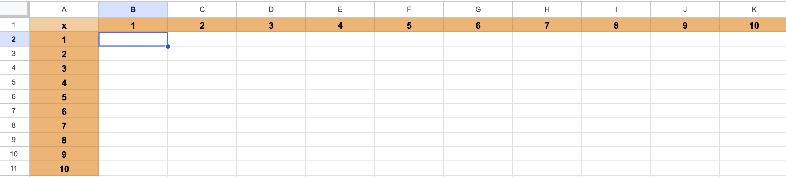

# Technologia informacyjna

**Laboratorium 6:** Podsumowanie.

**Wprowadzenie**

Po kilku tygodniach pracy z pakietem **Google Workspace** nadszedł czas na uporządkowanie zdobytej wiedzy i przygotowanie się do kolokwium zaliczeniowego. Dotychczasowe laboratoria obejmowały pracę z narzędziami Google Docs, Gemini, Keep, Forms, Sheets oraz Slides.

**Cel**

Celem tego laboratorium jest uporządkowanie materiałów na Dysku Google oraz przygotowanie się do kolokwium zaliczeniowego podsumowującego dotychczasową pracę z pakietem Google Workspace.

**Przygotowanie do kolokwium**

W ramach przygotowań do kolokwium zaliczeniowego z Technologii Informacyjnej, podsumowującego dotychczasową pracę z pakietem Google Workspace (Google Docs, Gemini, Keep, Forms, Sheets, Slides), należy uporządkować swoje materiały na Dysku Google.

**Porządkowanie zasobów na Dysku Google**

Przed przystąpieniem do kolokwium, proszę o zorganizowanie plików na swoim Dysku Google w następujący sposób:

- Na swoim Dysku Google należy utworzyć główny katalog o nazwie: **ti_[imię]_[nazwisko]** (np. **ti_tomasz_gądek**).
- Wewnątrz głównego katalogu należy utworzyć sześć podkatalogów o nazwach: **lab01** – **lab06**.
- Wszystkie **ukończone ćwiczenia** z poszczególnych laboratoriów należy przenieść do odpowiednich katalogów.
- Należy upewnić się, że wszystkie ćwiczenia są **kompletne i gotowe do weryfikacji**. Zawartość tych katalogów będzie sprawdzana podczas kolokwium.

**Przykładowe kolokwium**

**Zadanie 1: Tabela rekordzistów na 100m**

W Google Docs należy stworzyć tabelę prezentującą aktualnych rekordzistów świata w biegu na 100 metrów mężczyzn i kobiet. Wzoruj się na tabelach dostępnych na stronie [Bieg na 100 metrów](https://pl.wikipedia.org/wiki/Bieg_na_100_metr%C3%B3w) (z pominięciem flag). Należy również utworzyć hiperłącza tak, aby kliknięcie w nazwę zawodnika lub w nazwę miejsca zawodów przenosiło do odpowiedniej strony internetowej.

**Zadanie 2: Tabliczka mnożenia**

W Google Sheets należy wygenerować tabliczkę mnożenia od 1 do 100. W komórkach od B1 do K1 oraz od A2 do A11 należy wprowadzić liczby od 1 do 10. Następnie, w komórce B2 należy wprowadzić odpowiednią formułę wykorzystującą adresowanie mieszane. Nie należy wprowadzać żadnych wartości ani formuł w pozostałych komórkach przed wykonaniem przeciągnięcia. Przeciągnięcie komórki B2 w prawo i w dół powinno spowodować automatyczne wypełnienie całej tabliczki mnożenia.

Powodzenia na **kolokwium** 😉

**Podsumowanie**

Laboratoria z Technologii Informacyjnej pozwoliły zapoznać się z kluczowymi narzędziami pakietu Google Workspace. Umiejętność sprawnego korzystania z Google Docs, Sheets i Slides stanowi solidną podstawę do efektywnej pracy z dokumentami, danymi i prezentacjami w środowisku cyfrowym.
