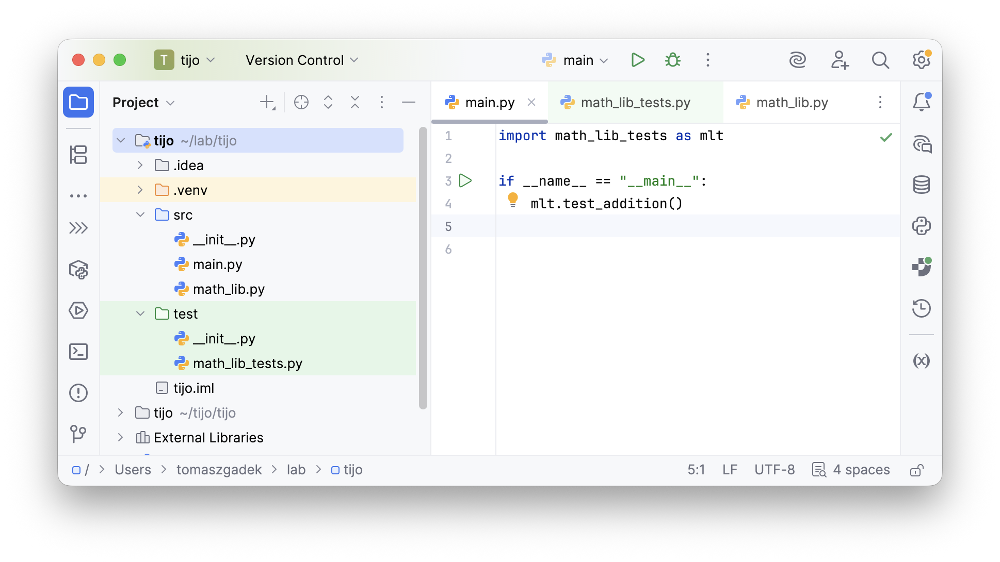

# Testowanie i jakość oprogramowania

**L#01:** Asercja, Arrange-Act-Assert (AAA).

**Wprowadzenie**

W trakcie tego laboratorium zapoznamy się z fundamentalnymi mechanizmami
weryfikacji poprawności oprogramowania. Zrozumienie działania asercji
oraz poprawnej struktury testu jest kluczowe dla tworzenia
oprogramowania wysokiej jakości.

**Cel**

Głównym celem laboratorium jest opanowanie umiejętności pisania testów
jednostkowych przy użyciu asercji oraz wdrożenie standardu
**Arrange-Act-Assert (AAA)** aby poprawić czytelność i organizację kodu
testowego.

**Asercja**

Jest to forma zdaniowa w danym języku, która zwraca prawdę lub fałsz.
Asercja wskazuje, że programista zakłada, że ów predykat jest w danym
miejscu prawdziwy. W przypadku gdy predykat jest fałszywy (czyli
niespełnione są warunki postawione przez programistę) asercja powoduje
przerwanie wykonania programu. Asercja ma szczególne zastosowanie w
trakcie testowania tworzonego oprogramowania.

Struktura asercji:

```python
result = (2 + 2) < 5
assert result, "2 + 2 nie jest mniejsze od 5. Zweryfikuj kod."
```

Zastosowanie asercji w praktyce:

```python
def add(first, second):
    return (first + second)


if __name__ == "__main__":
    assert add(1, 2) == 3, "add(1, 2) should return 3"
```

Postaraj się uruchomić skrypt, następnie zmodyfikuj warunek w taki
sposób, aby asercja zwróciła fałsz. Obserwuj co się dzieje w terminalu.

**Zadanie do wykonania**

Zaimplementuj funkcję **def max(digits)**, która wyszuka największy
element z kolekcji liczb całkowitych (digits). Zaproponuj dobre testy /
asercje:

- Test1: Obsługa None (gdy na wejściu pojawi się None to metoda zwraca
  None).
- Test2: Obsługa pustej kolekcji (gdy na wejściu pojawi się pusta
  kolekcja metoda zwraca None).
- Test3: Obsługa kolekcji jednoelementowej (metoda zwraca największy
  element).
- Test4: Obsługa kolekcji wieloelementowej (metoda zwraca największy
  element).

**Arrange-Act-Assert (AAA)**

**Arrange-Act-Assert (AAA)** to technika opisu testów, która pomaga w
tworzeniu klarownych, czytelnych i zrozumiałych przypadków testowych.
Jest to często stosowany format, który ułatwia organizację testów
poprzez podział na trzy etapy: przygotowanie warunków początkowych
(Arrange), wykonanie testowanej operacji (Act) oraz weryfikację
oczekiwanych rezultatów (Assert).

Zastosowanie Arrange-Act-Assert w praktyce:

```python
def add(first, second):
    return first + second


def test_addition():
    # Arrange
    first_number = 1
    second_number = 2

    # Act
    result = add(first_number, second_number)

    # Assert
    assert result == 3, "add(1, 2) should return 3"
```

**Zadanie do wykonania**

Podziel swój kod z poprzedniego zadania na kod produkcyjny (lokalizacja
**src**) i testowy (lokalizacja **test**). Asercje powinny znaleźć się w
oddzielnych funkcjach (jedna asercja na funkcję) oraz powinny być
zapisane zgodnie z konwencją **Arrange-Act-Assert**.



**Zadanie dodatkowe**

Zaimplementuj funkcję **def is_pesel_correct(pesel_digits:
list\[int\])**, która zweryfikuje, czy podany numer PESEL jest poprawny.
Zaproponuj dobre testy. Zastosuj poznane zagadnienia podczas
laboratorium.

**Podsumowanie**

Podczas tych zajęć omówiliśmy pojęcie asercji jako narzędzia do
przerywania programu w przypadku niespełnienia założeń logicznych.
Nauczyliśmy się również, jak dzielić test na trzy logiczne fazy (AAA),
co znacząco ułatwia późniejszą konserwację i analizę błędów w kodzie.
