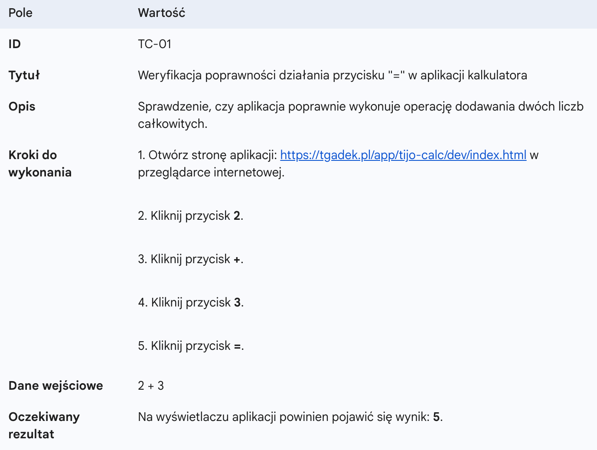
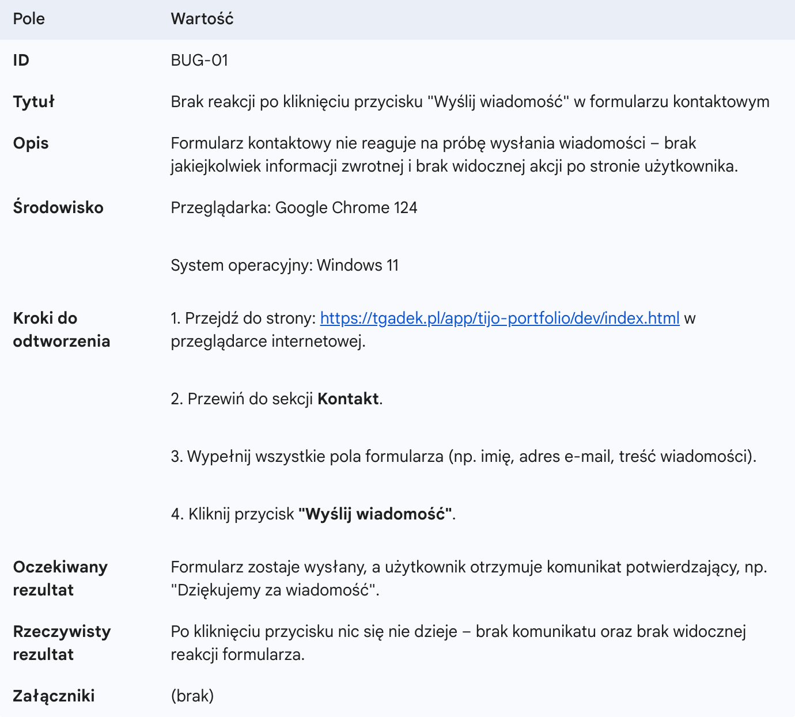

# Testowanie i jakość oprogramowania

**L#11:** Test Case & Bug Report.

## Wprowadzenie

**Test Case (Przypadek Testowy)** to dokument służący do weryfikacji,
czy system w odpowiedzi na konkretne akcje działa zgodnie z założeniami.
Ułatwia systematyczne i powtarzalne testowanie.

**Bug Report (Zgłoszenie Błędu)** to raport opisujący niezgodność między
działaniem faktycznym a oczekiwanym. Precyzyjne zgłoszenie pozwala
programiście sprawnie odtworzyć i usunąć usterkę.

## Cel

Celem laboratorium jest zapoznanie się z procesem dokumentowania
przypadków testowych oraz tworzenia raportów o błędach z wykorzystaniem
narzędzia Trello.

## Zadanie - Test Case & Bug Reports (Trello)

Masz do dyspozycji dwie aplikacje w wersji DEV (do testowania) i PROD
(jako dokumentacja referencyjna):

- Aplikacja "Kalkulator":
  [DEV](/app/tijo-calc/dev/index.html),
  [PROD](/app/tijo-calc/prod/index.html)
- Aplikacja "Portfolio":
  [DEV](/app/tijo-portfolio/dev/index.html),
  [PROD](/app/tijo-portfolio/prod/index.html)

Twoim pierwszym krokiem jest założenie konta w aplikacji
[Trello](https://trello.com). Dla każdej
aplikacji utwórz oddzielną tablicę, a następnie przeprowadź ich
**analizę porównawczą** (wersja PROD stanowi bezbłędny wzorzec).
Wszelkie zauważone różnice w działaniu są kluczem do sporządzenia
przypadków testowych (**Test Case**) i na ich podstawie raportów błędów
(**Bug Reports**).

W każdej tablicy utwórz kolumny (jedna tablica = jeden projekt):

- TestCase - Kalkulator, 2 karty \| Portfolio, 5 kart.
- Zgłoszenia (BugReports) - Kalkulator, 2 karty \| Portfolio, 5 kart.
- Zgłoszenia w trakcie - Kolumna bez kart.
- Zgłoszenia zweryfikowane - Kolumna bez kart.

## Podsumowanie

Testy pozwalają wykryć błędy i upewnić się, że produkt działa zgodnie z
oczekiwaniami użytkowników. Rzetelne dokumentowanie przypadków testowych
i zgłaszanie błędów to podstawowe narzędzia testera, które pozwalają na
efektywną współpracę z programistami i budowanie produktów o najwyższej
jakości.
