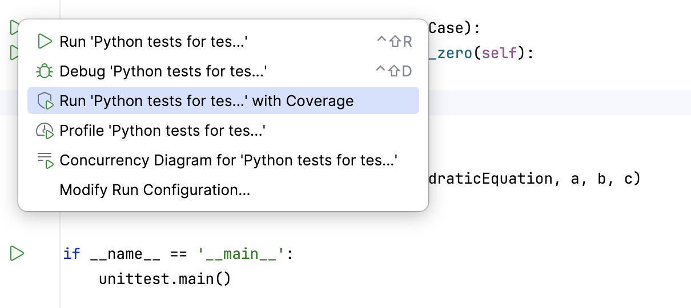
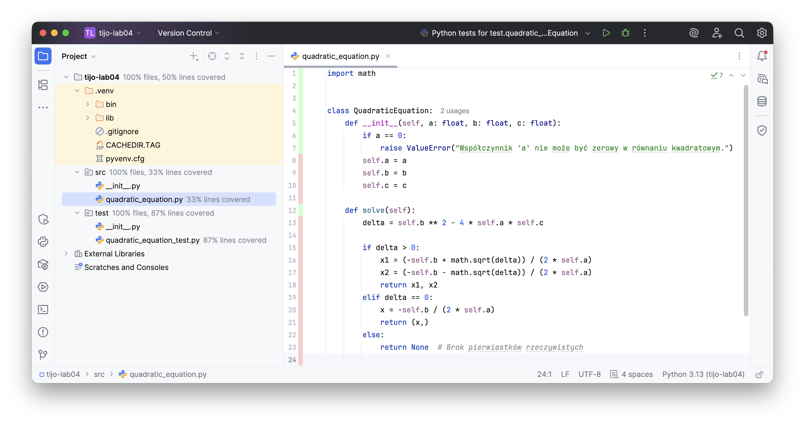

# Testowanie i jakość oprogramowania

**L#04:** Pokrycie kodu testami.

## Wprowadzenie

Pokrycie kodu testami (*ang. code coverage*) to mierzalna metryka
stosowana w inżynierii oprogramowania, która określa, jaki procent linii
kodu źródłowego został wykonany (skontrolowany) przez testy
automatyczne. Narzędzia do mierzenia pokrycia kodu pomagają
zidentyfikować obszary aplikacji, które nie są jeszcze chronione przed
potencjalnymi błędami.

## Cel

Głównym celem tego laboratorium jest poznanie technik analizy i
zwiększania pokrycia kodu testami. Nauczymy się generować powiązane
raporty w środowisku programistycznym (IDE) oraz interpretować ich
wyniki. Wykonując ćwiczenia praktyczne postaramy się osiągnąć maksymalne
(100%) pokrycie dla wybranych algorytmów.

## Pokrycie kodu testami w praktyce

Istnieje kilka rodzajów metryk oceniających pokrycie – można sprawdzać
pokrycie linii (czy dana linijka została wykonana), jak i pokrycie
rozgałęzień (czy sprawdzono wszystkie ścieżki warunków logicznych takich
jak if/else). W naszym przypadku skupimy się na podstawowej analizie
pokrycia bezpośrednio w IDE.

## Implementacja

Utwórz nowy projekt w **PyCharm** i umieść w pakiecie produkcyjnym
implementację klasy **QuadraticEquation**.

```python
import math


class QuadraticEquation:
    def __init__(self, a: float, b: float, c: float):
        if a == 0:
            raise ValueError("Współczynnik 'a' nie może być zerowy w równaniu kwadratowym.")
        self.a = a
        self.b = b
        self.c = c

    def solve(self):
        delta = self.b ** 2 - 4 * self.a * self.c
        if delta > 0:
            x1 = (-self.b + math.sqrt(delta)) / (2 * self.a)
            x2 = (-self.b - math.sqrt(delta)) / (2 * self.a)
            return x1, x2
        elif delta == 0:
            x = -self.b / (2 * self.a)
            return (x,)
        else:
            return None  # Brak pierwiastków rzeczywistych
```

Umieść w pakiecie testowym implementację klasy
**TestQuadraticEquation**.

```python
import unittest
from src.quadratic_equation import QuadraticEquation


class TestQuadraticEquation(unittest.TestCase):
    def test_should_raise_error_when_a_is_zero(self):
        # arrange
        a, b, c = 0, 2, 4

        # act & assert
        self.assertRaises(ValueError, QuadraticEquation, a, b, c)


if __name__ == '__main__':
    unittest.main()
```

## Testy z raportem

Postaraj się uruchomić testy z raportem pokrycia kodu testami. Przejedź
do skryptu z testami i kliknij w zieloną strzałkę (obok klasy) i wybierz
opcję widoczną na poniższym rysunku.



## Analiza

Po uruchomieniu testów zwróć uwagę na statystyki pokrycia kodu w kodzie
klasy **QuadraticEquation**. Kolor **czerwony** wskazuje linie, które
nie zostały pokryte testami. Kolor **zielony** wskazuje linie, które
zostały pokryte testami.



Mamy **33%** pokrycia kodu testami. Dopisz pozostałe testy i zwiększ
pokrycie kodu.

## Zadanie do wykonania

Twoje zadanie będzie polegało na implementacji operacji na bankomacie.
Skorzystaj z przygotowanej poniżej struktury klasy (wraz z dokumentacją
metod). Pamiętaj, aby pisać kod metodą TDD. Podczas implementacji i
uruchamiania testów analizuj i badaj pokrycie kodu testami.

Dla każdego cyklu stosuj odpowiednią strukturę commiów, np.:

- RED: implementacja testów dla weryfikacji salda
- GREEN: implementacja metody check_balance
- REFACTOR: refaktoryzacja kodu metody check_balance

Kod początkowy (**atm.py**):

```python
class ATM:
    """Klasa reprezentująca bankomat (ATM) z podstawowymi operacjami bankowymi."""

    def __init__(self, pin: int, initial_balance: float = 0.0):
        """Inicjalizuje bankomat z podanym saldem początkowym.

        :param initial_balance: Saldo początkowe konta.
        :raises ValueError: Jeśli saldo początkowe jest ujemne.
        """
        pass

    def check_balance(self, pin: int) -> float:
        """Sprawdza saldo konta użytkownika.

        :param pin: PIN użytkownika.
        :return: Saldo konta użytkownika.
        :raises InvalidPinException: Jeśli podany PIN jest nieprawidłowy.
        """
        pass

    def deposit(self, pin: int, amount: float) -> float:
        """Wpłaca środki na konto użytkownika.

        :param pin: PIN użytkownika.
        :param amount: Kwota do wpłacenia.
        :return: Aktualne saldo po wpłacie.
        :raises InvalidPinException: Jeśli podany PIN jest nieprawidłowy.
        """
        pass

    def withdraw(self, pin: int, amount: float) -> float:
        """Wypłaca środki z konta użytkownika.

        :param pin: PIN użytkownika.
        :param amount: Kwota do wypłacenia.
        :return: Aktualne saldo po wypłacie.
        :raises InsufficientFundsException: Jeśli saldo jest niewystarczające.
        :raises InvalidPinException: Jeśli podany PIN jest nieprawidłowy.
        """
        pass
```

## Podsumowanie

Dążenie do wysokiego stopnia pokrycia kodu testami zwiększa jakość
całego systemu informatycznego. Warto jednak pamiętać, że nawet 100%
pokrycia nie gwarantuje całkowicie bezbłędnej aplikacji. W teście liczy
się jakość asercji, a sama metryka służy jedynie jako wsparcie i
nawigacja pomagająca odnaleźć obszary, które testy automatyczne jeszcze
nie pokryły.
