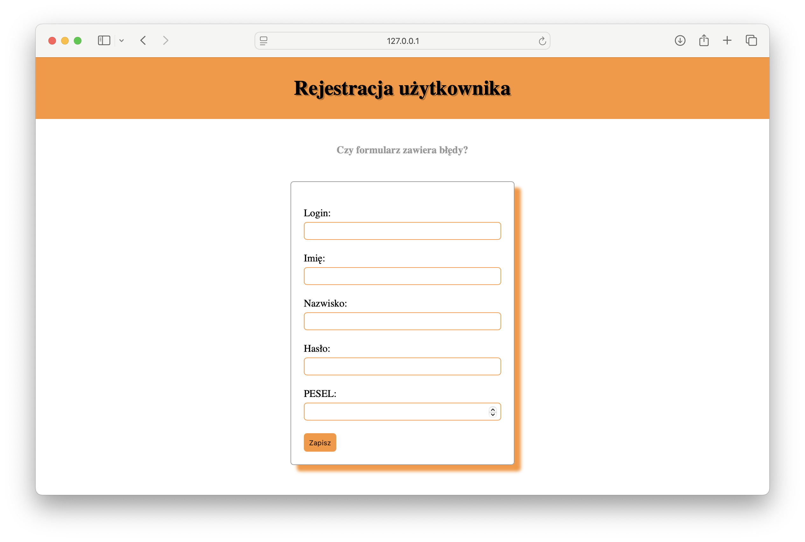

# Testowanie i jakość oprogramowania

**L#10:** Testy manualne, testowanie formularzy.

**Wprowadzenie**

**Testy manualne** to proces testowania oprogramowania, w którym tester
ręcznie wykonuje testy, aby sprawdzić, czy aplikacja zachowuje się
zgodnie z oczekiwaniami. W testach manualnych tester wykonuje konkretne
kroki, aby zweryfikować funkcjonalność aplikacji, identyfikować błędy i
oceniać ogólną jakość produktu.

**Cel**

Celem laboratorium jest zapoznanie się z procesem testowania formularzy
i walidacji danych w praktyce.

**Aplikacja Register**

Pobierz aplikację [register.zip](../prj/static/source-code/register/flask-form-app.zip) i dobrze przeanalizuj kod. Po
uruchomieniu aplikacji formularz rejestracji będzie dostępny pod adresem
[http://localhost:5000/](http://localhost:5000/).

Widok aplikacji po uruchomieniu serwera.

**Twoje zadanie**

Bardzo proszę przeanalizować kod i dokończyć (poprawić) walidację
pozostałych (istniejących) pól formularza rejestracji użytkownika
zgodnie z założeniami umieszczonymi w tabelce.

Implementacja walidacji = COMMIT (implementuj funkcjonalnośći etapami,
pamiętaj o dobrym opisie commit'a).

| POLE FORMULARZA | WALIDACJA |
|:---|:---|
| LOGIN | Pole nie może być puste. Pole może zawierać dowolny ciąg składający się minimum z 4 znaków. |
| FIRST_NAME | Pole nie może być puste. Pole może zawierać dowolny ciąg. |
| LAST_NAME | Pole nie może być puste. Pole może zawierać dowolny ciąg. |
| PASSWORD | Pole nie może być puste. Pole powinno składać się z minimum 4 znaków. Hasło powinno składać się przynajmniej z: Cyfry, wielkiej litery, małej litery, znaku specjalnego (!@#\$%^&\*()\_+-=). |
| PESEL | Pole nie może być puste. Weryfikacja numeru PESEL powinna zostać oparta o wyliczenie [cyfry kontrolnej](https://pl.wikipedia.org/wiki/PESEL#Cyfra_kontrolna_i_sprawdzanie_poprawności_numeru). |

**Podsumowanie**

Testowanie manualne formularzy to podstawowy i niezbędny element
zapewniania jakości każdej aplikacji internetowej. Prawidłowa walidacja
zabezpiecza aplikację przed wprowadzaniem niepoprawnych lub
niebezpiecznych danych.
