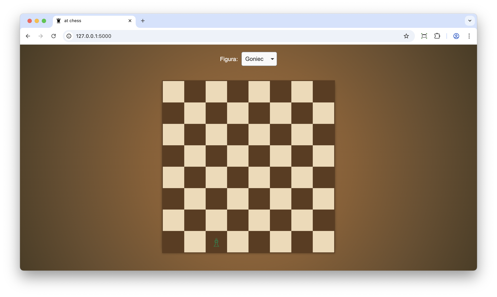
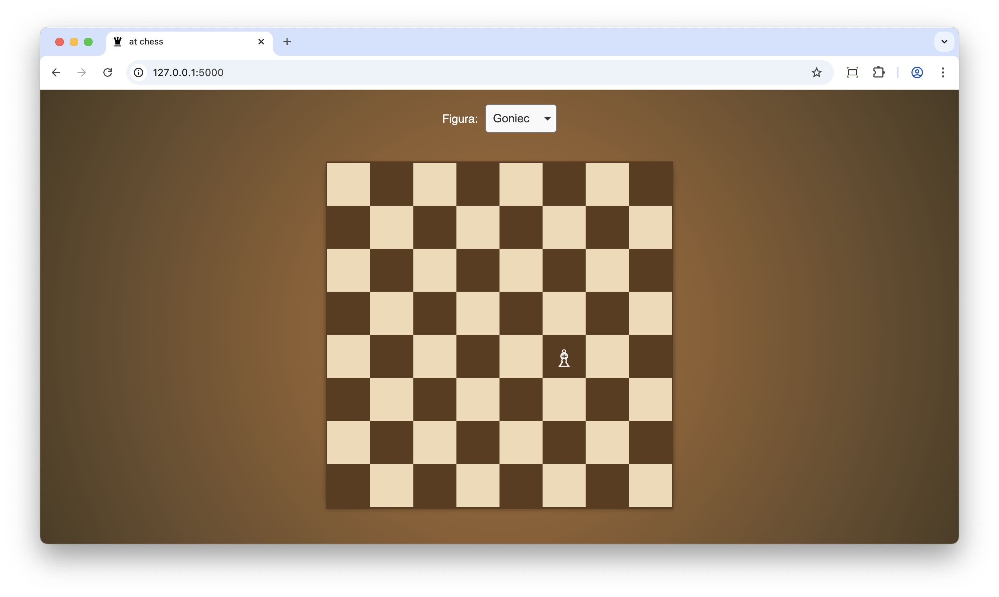

# Testowanie i jakość oprogramowania

**L#09:** Testy manualne.

**Wprowadzenie**

**Testy manualne** to proces testowania oprogramowania, w którym tester
ręcznie wykonuje testy, aby sprawdzić, czy aplikacja zachowuje się
zgodnie z oczekiwaniami. W testach manualnych tester wykonuje konkretne
kroki, aby zweryfikować funkcjonalność aplikacji, identyfikować błędy i
oceniać ogólną jakość produktu.

**Cel**

Głównym celem laboratorium jest zapoznanie się z procesem testowania
manualnego w praktyce. Nauczysz się weryfikować działanie aplikacji,
analizować jej zachowanie. Dodatkowo przeprowadzisz implementację
brakujących funkcji na podstawie analizy wyników testów manualnych.

**Aplikacja Chess**

Pobierz aplikację [chess.zip](../prj/static/source-code/chess/flask-chess-app.zip) i dobrze przeanalizuj kod. Po
uruchomieniu aplikacji gra będzie dostępna pod adresem
[http://localhost:5000/](http://localhost:5000/).

**Jak działa gra?**

Z pola typu **select** wybieramy figurkę, która nas interesuje.
Inicjujemy ruch poprzez zaznaczenie figury (klikamy na figurkę).

Następnie klikamy w pole docelowe, gdzie życzymy sobie, aby figurka się
przemieściła.

**Twoje zadanie**

Bardzo proszę dokończyć implementację logiki ruchów figurek na planszy
szachowej (ruchy figur szachowych:
[wikipedia](https://pl.wikipedia.org/wiki/Zasady_gry_w_szachy)). Wzorujemy się na implementacji, która
już istnieje. Aplikacja frontendowa została już zaimplementowana. Ruchy
figur powinny być testowane manualnie.

Po zakończonej implementacji zastanów się nad refaktoryzacją kodu. Zwróć
uwagę na wielokrotne instrukcje warunkowe realizujące poszczególne
ruchy. Czy da się zaimplementować to inaczej? (*Podpowiedź: Wykorzystaj
polimorfizm*).

**Podsumowanie**

Testy manualne są kluczowym elementem zapewniania jakości
oprogramowania, zwłaszcza na wczesnych etapach rozwoju oprogramowania
lub przy interfejsach użytkownika, które ciężko w pełni zautomatyzować.
Podczas testów wykonywanych ręcznie możemy dostrzec problemy z
perspektywy użytkownika końcowego, których nie dostrzeglibyśmy podczas
analizy kodu. Pozwalają one również na identyfikację błędów, które nie
zostały wykryte podczas testów automatycznych.
