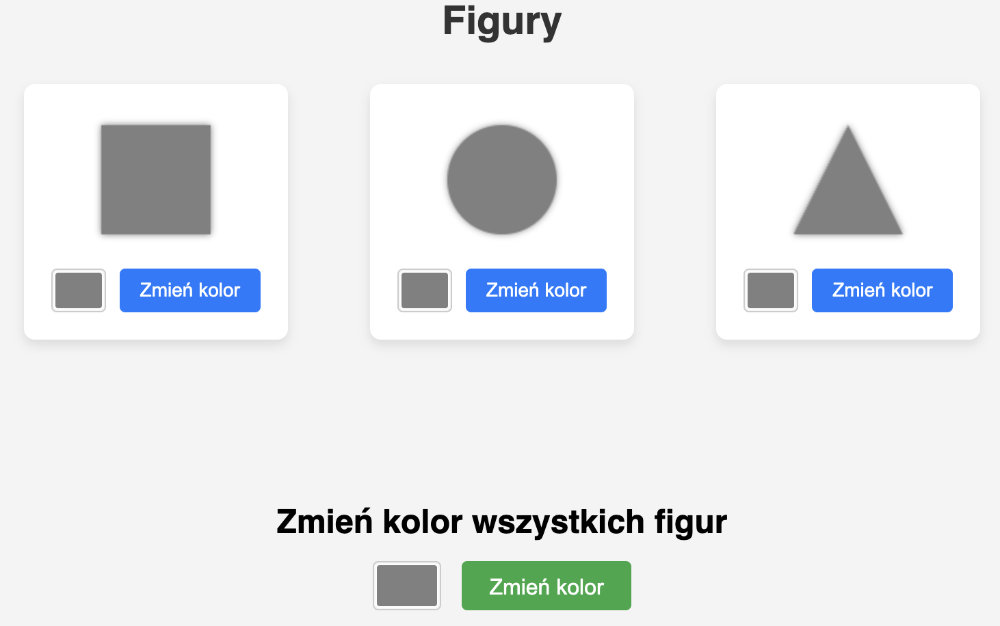

# Testowanie i jakość oprogramowania

**L#08:** OOP.

## Wprowadzenie

**Programowanie obiektowe** (ang. *Object-Oriented Programming*) to
paradygmat programowania, który opiera się na koncepcji obiektów.
Obiekty są instancjami klas, które definiują ich właściwości i
zachowanie. Programowanie obiektowe umożliwia tworzenie bardziej
złożonych i elastycznych aplikacji poprzez organizację kodu w moduły.

Programowanie obiektowe opiera się na kilku kluczowych koncepcjach:

- **Abstrakcja**: Proces ukrywania szczegółów implementacji i
  przedstawiania tylko istotnych cech obiektu.
- **Enkapsulacja**: Proces grupowania danych i metod w jedną jednostkę
  (klasę) oraz ograniczania dostępu do niektórych jej elementów.
- **Dziedziczenie**: Mechanizm, który pozwala na tworzenie nowych klas
  na podstawie istniejących, dziedzicząc ich właściwości i metody.
- **Polimorfizm**: Zdolność różnych klas do implementacji tych samych
  metod, co pozwala na użycie tych samych interfejsów w różnych
  kontekstach.

## Cel

Głównym celem tego laboratorium jest zrozumienie i praktyczne
zastosowanie mechanizmów programowania obiektowego. Nauczysz się tworzyć
bezpieczne metody dostępowe (gettery i settery), stosować mechanizm
kopii defensywnej w celu ochrony integralności obiektów, a także
przeprowadzisz refaktoryzację aplikacji webowej we Flasku do struktury
zorientowanej obiektowo.

## Zadanie - setter()

**setter()** jest odpowiedzialny za zmianę "wnętrza" obiektu. Jeśli
zaimplementujesz go niedbale, może narobić bałaganu. Weryfikuj, czy
podajesz sensowne dane, pilnuj, aby wszystko w obiekcie do siebie
pasowało po zmianie. Możesz łatwo "zepsuć" swój obiekt i wprowadzić go w
zły stan.

Prosty przykład: Wyobraź sobie setter **set_age()**. Jeśli pozwala ci
wpisać **-5** lat, to coś jest nie tak z Twoim obiektem **user**. Masz
okazję poprawić implementację poniższej klasy.

```python
class User:
    def __init__(self, name, age):
        self._name = name
        self._age = age
        self._is_adult = self._age >= 18

    def get_name(self):
        return self._name

    def get_age(self):
        return self._age

    def set_age(self, new_age):
        # Problem!
        self._age = new_age


user = User("Jan", 30)
print(f"Początkowy wiek: {user.get_age()}")
user.set_age(-5)
print(f"Wiek po ustawieniu nieprawidłowej wartości: {user.get_age()}")
user.set_age(200)
print(f"Wiek po ustawieniu absurdalnie dużej wartości: {user.get_age()}")
```

Porady dotyczące tworzenia metod ustawiających.

- **Sprawdzaj, co wpisujesz**: Upewnij się, że wiek nie jest ujemny.
- **Pilnuj porządku**: Jeśli zmiana wieku wpływa na inne atrybuty (np.
  status pełnoletności `is_adult`), setter wieku powinien również
  zaktualizować ten stan.
- **Pomyśl dwa razy**: Czy naprawdę potrzebujesz tylu setterów? Może
  zamiast zmieniać wszystko po kawałku, lepiej zrobić jedną akcję, która
  logicznie zmienia stan obiektu.

## Zadanie - getter()

**getter()** jest odpowiedzialny za bezpieczny odczyt danych z "wnętrza"
obiektu. Jeśli zaimplementujesz go niedbale, możesz ujawnić zbyt wiele.
Getter powinien być prosty, ale przemyślany – upewnij się, że zwraca
dane w odpowiedniej formie i nie zdradza więcej, niż powinien.

Klasa **Transfer** posiada niebezpieczny getter(). Zobacz, jak łatwo
można naruszyć integralność kluczowej operacji finansowej z zewnątrz.
Obiekt, reprezentujący gotówkę klienta, jest uszkodzony. Napraw go
stosując **kopię defensywną**.

```python
class TimeOfTransfer:
    def __init__(self, hour, minute):
        self.hour = hour
        self.minute = minute

    def __str__(self):
        return f"{self.hour:02d}:{self.minute:02d}"


class Transfer:
    def __init__(self, amount, transfer_time):
        self._amount = amount
        self._transfer_time = transfer_time

    def get_transfer_time(self):
        # Problem!
        return self._transfer_time

    def get_amount(self):
        return self._amount

    def execute_transfer(self):
        print(f"Wykonuje przelew na kwotę {self._amount} o godzinie {self._transfer_time}")


scheduled_time = TimeOfTransfer(14, 30)
my_transfer = Transfer(100.00, scheduled_time)
print(f"Początkowy czas przelewu: {my_transfer.get_transfer_time()}")
my_transfer.execute_transfer()

# Ups! Ktoś dobrał się do czasu przelewu...
time_from_getter = my_transfer.get_transfer_time()
time_from_getter.hour = 16
time_from_getter.minute = 0

print(f"\nCzas przelewu PO ZEWNĘTRZNEJ INGERENCJI: {my_transfer.get_transfer_time()}")
my_transfer.execute_transfer()
print("\nUps! Kluczowy czas obiektu przelewu został zmanipulowany z zewnątrz.")
print("Ot tak, integralność obiektu została naruszona, a to były czyjeś ciężko zarobione pieniądze.")
print("To tylko zwykły getter(), a jak wiele może zepsuć.")
```

## Zadanie - OOP i Flask

Pobierz aplikację: [flask-figure-app](../prj/static/source-code/oop/flask-figure-app.zip), skopiuj ją do katalogu źródłowego
**src** i uruchom moduł **app.py**.



Aplikacja jest prostą aplikacją webową, która pozwala na zmianę kolorów
figur geometrycznych. Używa Flask do obsługi żądań HTTP i renderowania
szablonu HTML.

Wykonaj refaktoryzację kodu i spełnij wymagania:

- Zdefiniuj klasy (Figure, Square, Circle, Triangle) reprezentujące
  figury z atrybutami i metodami.
- Utwórz kolekcję (np. słownik **figures**) przechowującą instancje
  figur.
- Utwórz dedykowaną klasę (serwis) odpowiedzialną za zarządzanie stanem
  figur.
- Zaimplementuj w serwisie metody do pobierania stanu kolorów figur w
  spójnym formacie (np. słownik).
- Użyj serwisu w module **app.py**. Zmodyfikuj funkcje obsługi żądań
  HTTP, aby korzystały z metod utworzonego serwisu do interakcji z
  figurami.

## Podsumowanie

Odpowiednio zaimplementowane mechanizmy enkapsulacji są niezbędne do
zachowania kontroli nad stanem obiektu. Używanie getterów i setterów w
sposób świadomy (z weryfikacją poprawności oraz kopiami defensywnymi)
zapobiega wstrzykiwaniu nieprawidłowych danych. Refaktoryzacja na
paradygmat obiektowy ułatwia zarządzanie i skalowanie aplikacji, co jest
szczególnie istotne w projektach webowych.
