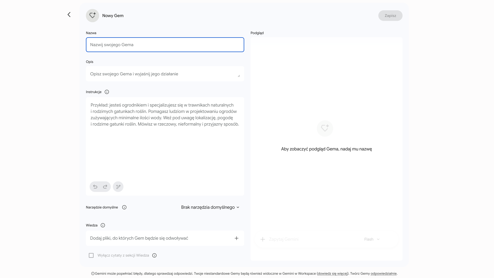
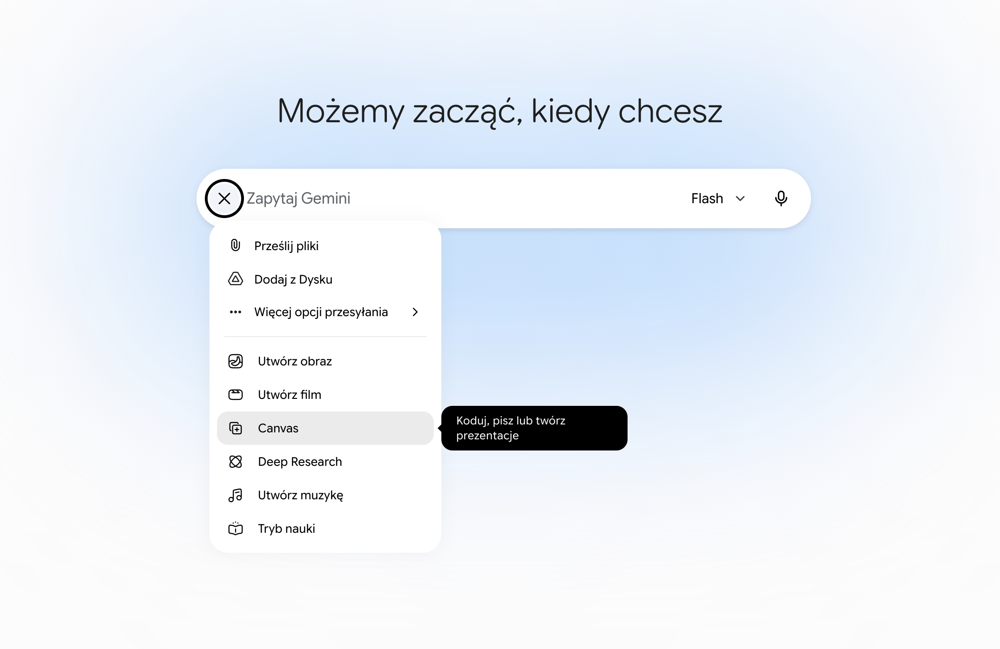

# Testowanie i jakość oprogramowania

**L#13:** QA & AI-Driven Development

## Wprowadzenie

Rola inżyniera jakości (QA) dynamicznie ewoluuje. Dziś nowoczesny tester
nie tylko manualnie weryfikuje oprogramowanie, ale przede wszystkim
projektuje zautomatyzowane procesy z wykorzystaniem AI. Podczas tego
laboratorium dowiesz się, jak sprawnie tworzyć własne, inteligentne
narzędzia i asystentów znacząco przyspieszających codzienną pracę.

## Cel

Praktyczne opanowanie środowiska Gemini (przejdź do
[Gemini](https://gemini.google.com)) w celu
tworzenia dedykowanych botów (Gems) generujących testy automatyczne.
Kolejnym etapem będzie błyskawiczna budowa własnego, przeglądarkowego
klienta API z wykorzystaniem interaktywnego panelu Gemini Canvas.

## Słownik pojęć

- **Data-Driven Testing (DDT):** Technika automatyzacji polegająca na
  oddzieleniu skryptów testowych od danych (zapisywanych w zewnętrznym
  pliku np. JSON, YAML lub CSV), co pozwala na wykonywanie tych samych
  testów dla wielu zestawów danych wejściowych.
- **Gemini Gem:** Spersonalizowana wersja asystenta AI, skonfigurowana
  pod konkretne zadanie za pomocą stałych instrukcji systemowych.
- **System Prompt** ([Instrukcja
  systemowa](https://workspace.google.com/intl/pl/resources/ai/writing-effective-prompts/))**:**
  Główna instrukcja nadająca asystentowi AI rolę, kontekst oraz
  określająca format wyjściowy i ograniczenia.
- **Gemini Canvas:** Zintegrowany, interaktywny edytor wbudowany w
  Gemini, pozwalający na programowanie, testowanie i edycję kodu
  bezpośrednio obok okna czatu.

## Automatyzacja tworzenia testów z Gemini Gems

**Gemini Gem** to spersonalizowany asystent AI działający w oparciu o
stałe instrukcje. Dzięki nim bot staje się wyspecjalizowanym narzędziem,
które nie traci kontekstu projektu podczas kolejnych sesji
programistycznych.

**Jak utworzyć Gema?**\
W lewym menu bocznym interfejsu Gemini przejdź do sekcji *Gemy (Gems)*.
Należy wybrać opcję **+ Nowy Gem**. Zostaniesz przekirowany do
formularza konfiguracji Gema, który składa się z następujących pól:

- **Nazwa (Name):** Krótka, identyfikująca nazwa asystenta.
- **Opis (Description):** Zwięzła informacja o przeznaczeniu bota.
- **Instrukcje (Instructions):** Najważniejsze pole (system prompt),
  które decyduje o zachowaniu AI. Wklejamy tu rygorystyczne wytyczne
  określające rolę, styl pracy oraz ograniczenia bota.
- **Wiedza:** Pliki lub zrzuty ekranu, które mają być wykorzystywane
  przez bota jako kontekst w procesie tworzenia kodu.
- **Podgląd:** Pole do testowania stworzonego bota.



Kluczem do sukcesu przy generowaniu testów jest podanie botowi
precyzyjnej **sygnatury metody**, wymagań biznesowych i wymuszenie w
promptach (instrukcjach Gema) rygorystycznego zwracania **wyłącznie kodu
źródłowego** (bez opisów). Zmusza to model do wygenerowania gotowego do
wdrożenia kodu testów, eliminując niepotrzebny szum informacyjny.

## Zadania do wykonania

**Zadanie 1: Budowa bota odpowiedzialnego za tworzenie testów**\
Utwórz Gema **Senior QA Test Generator**, którego wyłącznym celem jest
generowanie testów w bibliotece **unittest** dla języka Python na
podstawie dostarczonych wymagań biznesowych i sygnatury. Upewnij się, że
bot zwraca **wyłącznie kod źródłowy**. Kluczowe jest, aby w polu
**Instrukcje** wyegzekwować od bota stosowanie zasady **FIRST** (Fast,
Independent, Repeatable, Self-validating, Timely) oraz precyzyjny
podział kodu każdego testu na sekcje (np. Arrange-Act-Assert).
Przetestuj bota, przekazując mu poniższą deklarację oraz wymagania:

*Cena bazowa biletu to 50 PLN. Dzieci poniżej 12 r.ż. mają 50% zniżki,
seniorzy powyżej 65 r.ż. 30%. Klubowicze otrzymują dodatkowe 10% zniżki
naliczane kaskadowo (zniżka nie jest naliczana od kwoty bazowej, ale od
kwoty po zastosowaniu innych zniżek). Metoda rzuca wyjątek
**ValueError** dla ujemnego wieku.*

``` python
def calculate_ticket_price(age: int, is_club_member: bool) -> float:
    pass
```

**Zadanie 2: Budowa bota odpowiedzialnego za tworzenie produkcyjnego
kodu**\
Zbuduj drugiego Gema **Python Developer**, który na podstawie zwróconych
testów z Zadania 1 przygotuje czysty, produkcyjny kod metody. W polu
**Instrukcje** tego Gema kategorycznie zażądaj przestrzegania dobrych
praktyk inżynierskich: zasad **SOLID**, prawa **Demeter**, reguł
**KISS** (Keep It Simple, Stupid) i **DRY** (Don't Repeat Yourself).
Wygenerowany kod musi charakteryzować się najwyższą jakością. Skopiuj
wygenerowany kod, uruchom go w lokalnym środowisku i solidnie
przetestuj. Sprawdź, czy wszystkie testy zakończyły się powodzeniem.

*Wskazówka: Wykorzystaj świeżo zbudowane Gemy do wygenerowania i
weryfikacji testów dla logiki aplikacji, którą tworzyłeś w poprzednich
laboratoriach (np. **[L#02: Framework
unittest](unittest-framework.html)**, **[L#04: Pokrycie kodu
testami](code-coverage.html)**, **[L#06: Code
Smells](code-smell.html)**). To doskonała okazja, aby porównać kod
testów napisany manualnie z rozwiązaniami od GenAI.*

## Klient API w środowisku Gemini Canvas

**Gemini Canvas** to zaawansowany edytor pozwalający na błyskawiczne
prototypowanie, modyfikowanie i uruchamianie aplikacji webowych (np.
lekkich klientów API) bezpośrednio z poziomu przeglądarki, bez potrzeby
instalacji lokalnego IDE czy frameworków.



## Zadania do wykonania

**Zadanie 3: Prototypowanie klienta API**\
Zleć w Gemini (wykorzystując Canvas) zaprojektowanie nowoczesnego,
przeglądarkowego narzędzia do testowania API. Aplikacja powinna pozwalać
na wczytanie pliku ze specyfikacją testów (np. w formacie JSON, YAML lub
CSV), zawierającego listę zapytań HTTP (URL, metoda, opcjonalny payload)
oraz oczekiwane kody statusów. Narzędzie ma odczytać ten plik,
wygenerować listę testów i umożliwić ich zbiorcze uruchomienie jednym
przyciskiem. Całość powinna zamknąć się w jednym, czytelnym pliku
integrującym HTML, CSS oraz JavaScript (wybór bibliotek UI pozostaw
asystentowi). Zadbaj, aby interfejs czytelnie prezentował raport i
statusy wykonanych testów. Taką aplikację możesz udostępnić w formie
gotowego linku, a następnie dodać go do ulubionych zakładek w
przeglądarce. W ten sposób zyskasz wygodny i szybki sposób na
uruchomienie własnych testów z każdego miejsca na świecie.

**Zadanie 4: Testy integracyjne na żywo**\
Uruchom aplikację za pomocą przycisku **Preview** w oknie Canvas.
Przygotuj prosty plik ze specyfikacją (np. **tests.json**) dla darmowego
serwera , w którym zdefiniujesz
scenariusze dla różnych endpointów. Wczytaj plik do swojego nowego
narzędzia, uruchom kolekcję jednym kliknięciem i zweryfikuj, czy klient
poprawnie odczytał specyfikację, wykonał żądania oraz wygenerował
czytelny raport z informacją o sukcesach i błędach.

## Podsumowanie

Sztuczna inteligencja rewolucjonizuje szybkość budowania oprogramowania
i automatyzacji, lecz to na inżynierze QA spoczywa obowiązek
projektowania odpowiedniej architektury testów oraz **krytycznej
weryfikacji** kodu. Pamiętaj o ryzyku zjawiska
[halucynacji](https://pl.wikipedia.org/wiki/Halucynacja_(sztuczna_inteligencja))
modeli językowych. AI dostarcza tylko wysokiej jakości szkice, które
zawsze wymagają audytu przez specjalistę przed wdrożeniem.
