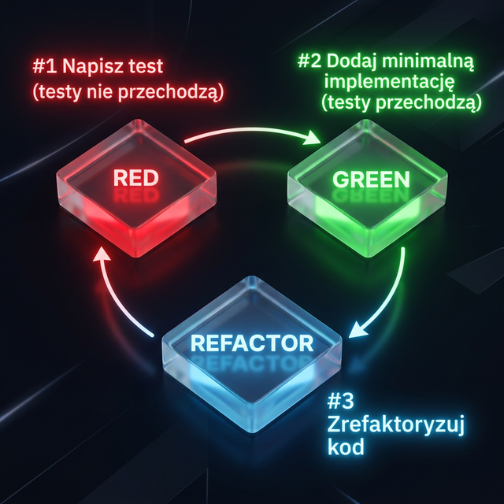

# Testowanie i jakość oprogramowania

**L#03:** TDD.

**Wprowadzenie**

Testowanie oprogramowania to nie tylko weryfikacja gotowego kodu. W
nowoczesnym podejściu proces ten potrafi dyktować architekturę samej
aplikacji, gwarantując, że każdy napisany fragment kodu bezpośrednio
realizuje założone odgórnie wymagania biznesowe i jest od samego
początku pokryty testami.

**Cel**

Głównym celem laboratorium jest opanowanie techniki **Test-Driven
Development (TDD)** oraz wdrożenie w praktyce cyklu wytwarzania
oprogramowania **Red-Green-Refactor**. Będziemy trenować krok po kroku
pisanie testów przed kodem produkcyjnym i refaktoryzację rozwiązań.

**Technika TDD**

**TDD**, czyli **Test-Driven Development** jest to technika tworzenia
oprogramowania, w której najpierw tworzone są testy dla nowej
funkcjonalności, a dopiero później implementowana jest sama
funkcjonalność, aby testy przeszły pomyślnie. Proces ten składa się z 3
głównych kroków.

- **RED**: Napisz test (testy nie przechodzą, brak implementacji
  funkcjonalności).
- **GREEN**: Dodaj **minimalną** implementację, aby testy się powiodły.
- **REFACTOR**: Zrefaktoryzuj kod do najprostszej implementacji, aby
  spełniał oczekiwane standardy (testy przechodzą).

Technika została stworzona przez [Kenta
Becka](https://pl.wikipedia.org/wiki/Kent_Beck).



Poniższy film prezentuje technikę TDD w praktyce. Przepisz kod, dopisz
brakujące testy (dodawanie wielu zadań oraz usuwanie zadania).
Zaktualizuj implementację klasy **TaskList** zgodnie z poznaną techniką.

<video controls preload="auto">
  <source src="../../static/tijo/video/tdd.mp4" type="video/mp4">
  Twoja przeglądarka nie obsługuje wideo.
</video>

Powyższy przykład demonstruje użycie **TDD** (Test-Driven Development) w
Pythonie. Zaczynamy od napisania testu (RED), który opisuje oczekiwane
zachowanie kodu, który jeszcze nie istnieje. Następnie piszemy minimalną
implementację (GREEN), która sprawia, że test przechodzi. Na koniec
refaktoryzujemy kod (REFACTOR), aby poprawić jego jakość, nie zmieniając
jego funkcjonalności.

**Zadanie do wykonania**

**System zarządzania studentami AT**

Twoim zadaniem będzie implementacja programu zarządzającego studentami
przy użyciu techniki TDD (*ang. Test-Driven Development*). Aplikacja
powinna umożliwiać dodawanie, aktualizowanie, usuwanie studentów,
wprowadzanie ocen oraz obliczanie średniej ocen z przedmiotu.

Kod początkowy projektu:

```python
# student_management.py

class StudentManagement:
    """Klasa zarządzająca studentami i ich ocenami."""

    def add_student(self, student_id: str, name: str, age: int) -> bool:
        """Dodaje nowego studenta do bazy danych.

        Args:
            student_id: unikalny identyfikator studenta.
            name: imię studenta.
            age: wiek studenta.

        Returns:
            True, jeśli dodanie zakończyło się sukcesem.
            False w przeciwnym wypadku.
        """
        pass  # Implementacja dodawania studenta

    def update_student(self, student_id: str, name: str, age: int) -> bool:
        """Aktualizuje dane istniejącego studenta na podstawie identyfikatora.

        Args:
            student_id: unikalny identyfikator studenta.
            name: imię studenta.
            age: wiek studenta.

        Returns:
            True, jeśli aktualizacja zakończyła się sukcesem.
            False w przeciwnym wypadku.
        """
        pass  # Implementacja aktualizacji studenta

    def remove_student(self, student_id: str) -> bool:
        """Usuwa studenta z bazy danych na podstawie jego identyfikatora.

        Args:
            student_id: unikalny identyfikator studenta.

        Returns:
            True, jeśli usunięcie zakończyło się sukcesem.
            False w przeciwnym wypadku.
        """
        pass  # Implementacja usuwania studenta

    def add_grade(self, student_id: str, subject: str, grade: float) -> bool:
        """Dodaje ocenę z danego przedmiotu dla określonego studenta.

        Args:
            student_id: unikalny identyfikator studenta.
            subject: nazwa przedmiotu.
            grade: ocena.

        Returns:
            True, jeśli dodanie oceny zakończyło się sukcesem (2.0, 3.0, 3.5, 4.0, 4.5, 5.0).
            False w przeciwnym razie.
        """
        pass  # Implementacja dodawania oceny

    def avg_grades(self, subject: str) -> float:
        """Oblicza średnią ocen z danego przedmiotu dla wszystkich studentów.

        Args:
            subject: nazwa przedmiotu.

        Returns:
            Średnia ocen z przedmiotu jako liczba zmiennoprzecinkowa.
        """
        pass  # Implementacja obliczania średniej ocen
```

**Podsumowanie**

Dzięki technice TDD twój kod zyska na jakości, będzie lepiej
przetestowany, a Ty nabierzesz pewności, dodając nowe funkcjonalności
lub wprowadzając refaktoryzację. Pamiętaj o cyklu Red-Green-Refactor i
konsekwentnym nazywaniu testów.
