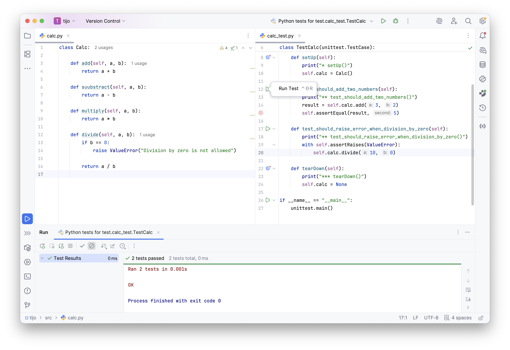

# Testowanie i jakość oprogramowania

**L#02:** Framework unittest.

**Wprowadzenie**

Testowanie jednostkowe to fundament tworzenia niezawodnego
oprogramowania. Framework **unittest** jest standardowym narzędziem do
testów jednostkowych w ekosystemie Pythona. Dostarcza on silnik do
uruchamiania testów oraz bogaty zestaw asercji. Pozwala na separację
logiki testowej od produkcyjnej oraz automatyzację procesu weryfikacji
zmian w kodzie.

**Cel**

Celem laboratorium jest zapoznanie się z architekturą testów w
frameworku **unittest**. Skupimy się na izolacji przypadków testowych
poprzez metody cyklu życia (`setUp`, `tearDown`), weryfikacji sytuacji
wyjątkowych oraz stosowaniu spójnych konwencji nazewniczych. Na
przykładzie klasy koszyka zakupowego przećwiczymy projektowanie testów
dla złożonej logiki biznesowej.

**Framework unittest**

Spójrz na podstawową strukturę testu przy użyciu tego frameworka.
Postaraj się przeanalizować kod, a następnie dokończyć implementacje
testów (nie zapominając o konwencji AAA) oraz klasy **Calc**.

```python
import unittest
from src.calc import Calc


class TestCalc(unittest.TestCase):
    def setUp(self):
        print("* setUp()")
        self.calc = Calc()

    def test_should_add_two_numbers(self):
        print("** test_should_add_two_numbers()")
        result = self.calc.add(3, 2)
        self.assertEqual(result, 5)

    def test_should_raise_error_when_division_by_zero(self):
        print("** test_should_raise_error_when_division_by_zero()")
        with self.assertRaises(ValueError):
            self.calc.divide(10, 0)

    def tearDown(self):
        print("*** tearDown()")
        self.calc = None


if __name__ == "__main__":
    unittest.main()
```

Zaimplementuj brakujące metody w klasie **Calc** (add(), subtract(),
multiply(), divide()). Po uruchomieniu testów przeanalizuj logi widoczne
w konsoli.

**Struktura testów**

- W pierwszej kolejności importujemy bibliotekę **unittest**, która
  zawiera funkcje do testowania.
- Każdy test jednostkowy w **unittest** musi być zawarty w klasie, która
  dziedziczy po **unittest.TestCase**.
- Metoda **setUp()** jest wywoływana przed każdym testem. Jest to
  miejsce, gdzie inicjalizujemy obiekty lub zasoby, które będą używane w
  testach.
- Każda metoda testowa musi zaczynać się od **test\_**. Jest to
  konwencja, którą **unittest** wykorzystuje do rozpoznawania metod,
  które są testami. Każda metoda testowa sprawdza jedną, konkretną
  funkcjonalność.
- **assertEqual()** to najczęściej używana metoda do porównywania
  oczekiwanego wyniku z wynikiem rzeczywistym. Sprawdza, czy oba
  argumenty są sobie równe.
- **assertRaises()** jest używana do testowania, czy w odpowiednich
  sytuacjach jest rzucany wyjątek (np. **ZeroDivisionError** przy
  dzieleniu przez zero).
- **tearDown()** jest wywoływana po każdym teście i służy do zwalniania
  zasobów lub zamykania połączeń.
- Testy uruchamiamy za pomocą **unittest.main()**, co powoduje
  automatyczne wykrycie i uruchomienie wszystkich metod testowych.

**Nazewnictwo testów**

Poprawne nazywanie plików, klas i metod testowych jest kluczowe dla
utrzymania porządku w projekcie oraz szybkiej analizy wyników testów.

| Element struktury | Wymóg techniczny | Przykładowa konwencja klasyczna |
|:---|:---|:---|
| Nazwa pliku | `test_*.py` lub `*_test.py` | `test_user_service.py` |
| Nazwa klasy | `Test*` (zalecane) | `TestUserAuthentication` |
| Nazwa metody | `test_*` (wymagane) | `test_invalid_password_rejection` |

Wybór stylu nazewnictwa metod wpływa na czytelność raportów generowanych
przez narzędzia testowe.

| Styl nazewnictwa | Przykładowa nazwa metody                             |
|:---|:---|
| Minimalistyczny  | `test_add`                                           |
| BDD (Should)     | `test_should_add_two_positive_integers`              |
| Fact-based       | `test_adds_two_positive_integers`                    |
| Given-When-Then  | `test_given_two_ints_when_added_then_sum_is_correct` |

**Ważne:** Niezależnie od wybranego stylu, kluczowe jest trzymanie się
**jednej konwencji** w obrębie całego projektu. Zapewnia to spójność i
ułatwia pracę innym programistom.

**Uruchomienie testów**

Po poprawnym zaimplementowaniu testów oraz klasy produkcyjnej, możemy
przystąpić do ich uruchomienia. Poniżej zaprezentowano przykładowy widok
z konsoli po pomyślnym wykonaniu wszystkich przypadków testowych.



**Zadanie do wykonania**

Twoje zadanie będzie polegało na implementacji koszyka zakupowego oraz
zestawu testów jednostkowych. Poniżej znajduje się kod źródłowy, który
definiuje oczekiwaną strukturę klasy.

```python
class ShoppingCart:
    def add_product(self, product_name: str, price: int, quantity: int) -> bool:
        """Dodawanie produktu do koszyka.

        Parametr 'product_name' traktujemy jak identyfikator, nie można dodać
        nowego produktu o tym samym identyfikatorze. Metoda powinna zwrócić
        False jeżeli przekażemy produkt, który już istnieje w koszyku.
        """
        # 'pass' pozwala na utworzenie pustego bloku, gdy nie ma implementacji.
        # Do usunięcia.
        pass

    def remove_product(self, product_name: str) -> bool:
        """Usuwanie produktu z koszyka"""
        pass

    def update_quantity(self, product_name: str, new_quantity: int) -> bool:
        """Aktualizacja ilości produktu w koszyku"""
        pass

    def get_products(self):
        """Pobieranie nazw produktów z koszyka"""
        pass

    def count_products(self) -> int:
        """Pobieranie liczby produktów znajdujących się w koszyku"""
        pass

    def get_total_price(self) -> int:
        """Pobieranie sumy cen produktów w koszyku"""
        pass

    def apply_discount_code(self, discount_code: str) -> bool:
        """Zastosowanie kuponu rabatowego. Jaką formę promocji proponujesz?"""
        pass

    def checkout(self) -> bool:
        """Realizacja zamówienia.

        W tym miejscu proponuję zaimplementować logikę, która będzie symulowała
        proces zakupu. Metoda zwraca True, jeżeli zamówienie zostało
        zrealizowane pomyślnie, a False w przeciwnym wypadku (np. brak
        produktów w koszyku).
        """
        pass
```

Pamiętaj, aby przed implementacją konkretnej metody napisać dla niej
test (o technice TDD szerzej opowiemy sobie na kolejnych zajęciach).
Zastosuj poznaną konwencję **Arrange-Act-Assert** w każdej metodzie
testowej.

**Podsumowanie**

Opanowanie frameworka **unittest** pozwala na budowę solidnej siatki
bezpieczeństwa dla kodu. Kluczowym elementem jest nie tylko sama
weryfikacja wyników, ale także dbałość o czytelność raportów poprzez
precyzyjne nazewnictwo oraz zachowanie izolacji testów. Takie podejście
minimalizuje ryzyko regresji i ułatwia późniejszą refaktoryzację kodu.
